# 王占峰

## 计科：项目管理

# 1	摸底测试

不做任何考核依据，   1小时 ，    只做    1-5，11-15，21-25..............


# 2	项目

为了得到某种  产品  、 服务、 成果 而付出的  临时的  一次性努力。

## 项目特点

临时性：有开始时间，有结束时间， 项目追求结束

独特性：其他项目的资料可以借鉴，而不能直接复用。

渐进明细性：随着项目的推进逐步细化过程


## 项目管理

项目管理综合利用   技能、管理技巧、行业标准、人际关系   实现项目目标

通用的过程：Plan      Do        Check Action

### 人力资源的管理

P：制定人力资源管理规划：定宗旨 ，选标准 ，如何实现标准。确定角色和职责

D：组建团队：   事先分派，谈判，招募，虚拟团队。  从0到1的过程

CA：建设团队：从有到优过程，提高团队绩效，提高个人能力

CA：管理团队：管理冲突


优秀团队的标准：

共同目标

明确自己对目标的贡献

明确的责任划分 RACI 原则

有行之有效的工作流程以及互相学习的环境【结对】

有冲突解决方法


熟悉不同的组织结构对项目的影响：

项目型结构和职能组织型结构：


分组实现任务，每8人一组，每组一名leader

推举一名leader，作为直接**管理**者身份参与

作为一名leader整个项目团队的负责人，考核加权值较高

应该拥有哪些能力：

​	通用的管理技能【KPI】

​	应用领域的知识标准和规定

​	项目管理的技能知识【成本、进度、质量、风险】

​	良好的沟通和协调能力


构建一个顺畅的沟通渠道。简单的沟通【微信群】，复杂的文档【Git】。

课堂实践：   30分钟， 成果物   提交   推选leader的过程【理由】以及决议，截止14：25


# 沟通的认知

沟通的目的  共享信息

沟通存在障碍的： 

​	认知障碍：同源信息的不同理解，无歧义的描述

​	语义障碍：不同干系人经历以及环境

如何做好沟通：

​	主动沟通

​	了解对方的沟通风格和沟通方式

​	采用对方能够接受的共同手段【头脑风暴，纵向，横向思维法】


文档为何需要沟通，组内共享编辑，组外发布。


# 配置管理

事物的属性的描述

通常  ， 硬件， 软件，数据    都会有属性

配置项的集合描述称为   配置库  ，便于理解和统一控制   ， 计算机行业中 配置库通常  有    开发库、主库、产品库  。

结合配置管理工具实现：通常采用  SVN     或者    Git    

主要目标：    记录所有文件的状态，  团队内共享编辑

采用版本号方式便于成员识别：推荐标准      X.Y.Z

X	主版本		架构

Y	次版本		功能

Z	修改状态	有Z代表不稳定  

第一个正式版本：  1.0    ，     0.x   代表草稿


# git基本使用

分布式 多人  共享   库   ， linux   开发者编写的

需要客户端工具平台：    git   

借助于类linux命令实现管理


git add *   将所有文件添加到暂存区

git  commit   -m  “提交日志”    *

git push


# 8021回顾

知识体系：硬件、网络、软件、项目

项目管理：项目、项目管理PDCA、人力资源、沟通、配置【git】


# 网络安全基础

## 1	体系结构概览


## 2	主机接口层

802.3	以太网的工作方式

采用争用介质：  先听后发，边听边发，冲突停止，随机延迟后重发      【解决了使用信道的问题】


发送和接收的问题：【物理地址】

通常称之为MAC地址，出厂自带全球唯一   48位地址，    使用16进制表示

常见的MAC地址： 取值范围  0-F   ，  全1的地址为广播地址   FF-FF-FF-FF-FF-FF  ,  全0地址 包装  源地址  ，

第8位地址为1，代表组播地址，   0 代表单播地址   

通过    ipconfig   /all    或者   ifconfig   

数据的识别问题：  包的格式  


结合   arp工具   ，  操作   mac地址已经绑定关系


### 任务1：阐述海明码的工作机制以及C++实现。

### 任务2：阐述arp协议以及arp命令工作机制及安全防范措施。


## 网络层

选路【路径选择】，识别，隔离

识别的问题：    协议封装格式   IP协议包


IP协议的特点：无连接，不可靠， 尽最大努力服务（TTL --- 解决环路问题）

TTL的协商是由双端通信方确定的，

### 课堂练习：利用ping  草拟出   到达  202.118.66.66  的网络路径， 探测路径的MTU


逻辑层， 利用ip地址进行身份识别 ， 利用ip进行隔离

## IP4地址

32位的逻辑地址，   采用   点分十进制表示   ，    分为   4个字节用点分隔，    1.2.3.255  ，每字节   0-255

IP地址 =  网络号   +   主机号   ，    默认情况下不同网络号的主机不能直接通信，   借助于路由器进行通信

通常   会将  IP分为    多种类别


例如：   

1.2.3.4	和	133.2.3.4   是不是逻辑上的一个网段：false

1.2.3.4   和   1.6.7.8    是不是逻辑上的一个网段 ： True

1.2.3.4   和   2.6.7.8    是不是逻辑上的一个网段 ： false

192.168.2.6   请问网络号    192.168.2        主机号    6

通过  子网掩码  标识  网络号部分（用1标识）和主机号部分（用0 表示）

1.2.3.4   子网掩码   255.0.0.0【默认】

出于VLSM或CIDR的需求。需要人为改动子网掩码进行网络的切分【延长VLSM】和汇聚【缩短CIDR】

例如：  单位申请了一个IP段   199.9.9.0 /24  / 255.255.255.0     ， 需要分为4个逻辑网段。

需要借用几位主机号用以分隔：  2位

每网段IP范围：   

​	199.9.9.0  -  199.9.9.63	             		  /26    /  255.255.255.192

​	199.9.9.64  -  199.9.9.127            		   /26    /  255.255.255.192

​	199.9.9.128  -  199.9.9.191            		/26    /  255.255.255.192

​	199.9.9.192  -  199.9.9.255            		/26    /  255.255.255.192

判断是否能够直接通信的依据是：  IP二进制位与子网掩码 ，结果是网络号，相同则可以直接通信

199.9.9.0  和   199.9.9.64   不一样，必须通过路由器通信


课堂演练： 本单位申请了一个   166.6.0.0/16网段， 全国有3个办事处和一个总部，  规模分别是   北京32000个， 上海   16000个，  重庆8000个，大连总部8000个。

规划各个区域的ip地址范围，包括   网络地址和实际可用地址


特殊的IP地址：

0.0.0.0	表示任意网段，作为目的地址表示任意一个ip

255.255.255.255	表示有限广播地址，等同于  FF-FF-FF-FF-FF-FF

合法网络号 + 全0主机号    表示的是网段的地址        192.168.3.0/24

合法网络号 + 全1主机号	表示的是网段的直接广播地址		192.168.3.255

回环地址：  127.x.x.x   本地回环测试，不通过物理接口直走协议缓冲区

私有IP，  只能在局域网通信   （10.x.x.x/8     ,  172.16.x.x/16 - 172.31.x.x /16    ,   192.168.x.x/24   ,  169.254.x.x  / 16 ）


课堂演练： 本单位申请了一个   166.6.0.0/16网段， 全国有3个办事处和一个总部，  规模分别是   北京32000个， 上海   16000个，  重庆8000个，大连总部8000个。

规划各个区域的ip地址范围，包括   网络地址和实际可用地址


网络号16位 + 主机号16位，  可用的IP   2^16 - 2 = 65534个   

VLSM  延长子网掩码   切分的过程，借用主机号部分作为子网络号部分

1	2	3	4	5	6	7	8      .    1	2	3	4	5	6	7	8

0	0	0	0

0	1	1	1

1	0	0	0	0

​			1	1	1		

1	1	0	0	0

​				  1	1

1	1	1	0	0

​				  1	1

166.6.0.0【子网段】~166.6.127.255【直接广播】     /   17  /255.255.128.0    容纳   32765-2主机【北京】

166.6.128.0【子网段】~166.6.191.255【直接广播】/   18  /255.255.192.0    容纳   16385-2主机【上海】

166.6.192.0【子网段】~166.6.223.255【直接广播】/   19  /255.255.224.0    容纳   8192-2主机【重庆】  

166.6.224.0【子网段】~166.6.255.255【直接广播】/  19  /255.255.224.0    容纳   8192-2主机【大连】  


网络层的路由，根据IP包头的目的地址进行选路 ，  选路的依据是路由表， 路由表一般分为静态（手工维护）和动态（路由器自动学习），路由表的组成（路由类型，路由成本，下一跳）


如何维护路由表：

windows和linux 本身带有软路由。如何获取以及修改

windows：  router   print

linux：  route


路由的类型：

​	直连路由C，  只要网络接口配置IP并且接口是激活状态，形成直连路由，成本为0  

​	静态路由S，   关注  目标网段、目标网段的子网掩码，下一跳

​	默认路由S*，最后一条匹配的路由选项【优先级最低】， 俗称 默认网关【0.0.0.0】

​	

路由匹配过程中， 遵循   掩码长度原则，  掩码越长优先级越高

277-711-380

### 课堂项目：小组为单位实现，通过虚拟机或者wsl方式实现通过手工添加路由进行windows和linux之间的通信【虚拟机平台的构建，路由操作，文档记录】，成果物   路由基础.md   发送到小组群即可


## 模拟实现企业网络环境，借助于模拟器可以模拟  交换机、路由器等

只能使用   192.168.1.0/24网段


# 上周回顾

1	网络体系结构

2	数据链路层【8022.3 】arp 

3	网络层【ip】路由表，静态路由

4	项目管理【项目，资源，沟通】


# IOS的使用

网络设备运行的操作系统， 提供   CLI 【命令行】  功能   ，   管理设备

管理设备都有什么方式？  web管理端，命令行，console连接【初始化】


ios   其实是unix的变体

1	tab补齐  ，补齐命令和  参数   ,  能补齐代表可以缩写

2	上下方向键 ，翻阅历史记录

3	history调取所有历史记录

4	？  查阅帮助


通过命令字实现基本操作

课堂演练：实现网络基本布局图【配置使用CLI完成】


网络设备：

集线器：  HUB   ，  物理层连接设备 ，    共享带宽，一个冲突域


交换机【二层】，Switch     ，  数据链路层  连接设备，    共享带宽，虚拟通道， 切割冲突域


路由器【三层】， router，   网络层连接设备  ，    切割广播域


全局模式对设备生效的（conf   t）， 接口模式(int 接口名)只对当前接口生效


# 交换机的工作方式

根据  端口和MAC地址映射表（自动数据帧源地址学习--动态（300S））进行转发操作 ，如果不存在条目，则广播（除了输入口之外的所有口）【arp广播——源地址发送者地址，目的地址FF-FF-FF-FF-FF-FF】，实际接收者回应   单播   信息。


# 局域网网络安全

1	使用虚拟局域网     VLAN

2	VLAN用以切割广播域

3	在数据帧添加头部信息用以识别， 通常是在交换机上执行 添加/拆除操作  。

4	VLAN的形式：  802.1Q 标准  ，   ISL标准


5	VLAN注意：   VLAN1是默认的不可删除的默认所有端口都在VLAN1的  ， VLAN根据id不同进行匹配 ，VLANid  从   1 -4096  ，建议规划方式      100，200，300

6	vlan有两种模式：  接入模式access（只能访问1个vlan信息）  ，  干道模式trunk（利用一条线路传输多个VLAN数据）

```shell
SW>enable	#进入特权模式
sw#show vlan	#查看vlan配置信息
sw#configure terminal	#进入全局配置模式
sw(conf)#vlan  100		#添加id为100 名称为  vlan0100的vlan
sw(conf-vlan)#vlan  200		#添加id为200 名称为  vlan0200的vlan
sw(conf)#interface fa0/1	#进入端口配置模式
sw(conf-if)#switchport mode access	#设置当前端口为access接入模式
sw(conf-if)#switchport access vlan 100	#当前端口可以访问vlan 100
sw(conf-if)#exit
sw(conf)#interface range fa0/2-9	#同时进入多个接口配置
sw(conf-if)#switchport mode access	#设置当前端口为access接入模式
sw(conf-if)#switchport access vlan 200	#当前端口可以访问vlan 200
sw#show vlan


```


# Vlan trunk

需要公共通道传递多个vlan的数据，一条线路承载多个vlan的通信，  解决access占用过多线路

Trunk通信时类似于包转发方式，   干道上的所有帧都带有vlan标记

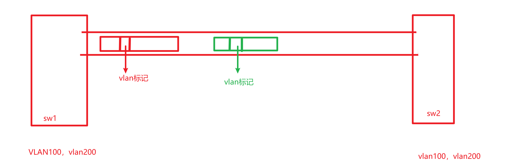


 单臂路由，实现不同vlan之间的通信，路由器的物理接口可以绑定多个逻辑子接口

路由和交换基础实验

提交： markdown文档， 打包提交至  微信群

文档内容：概念，使用场景，实现步骤（配置命令+截图）

先决条件：申请到了199.9.9.0/24网段

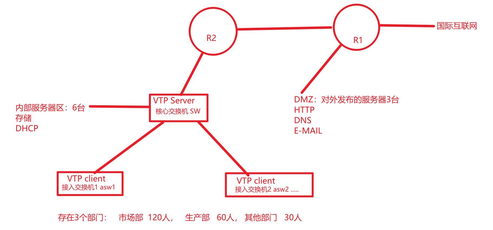


# 动态路由

如果接口配置了ip并且激活状态， 则存在   C  的 直连路由， 直接到达目的地，成本为 0

非直连网络需要    手工添加    静态路由      S     ，    成本   为   1，

默认路由     是   特殊的静态路由      S*      ，   最后匹配， 优先级最低   ，  一般存在于末梢网络

通过路由汇总可以解决路由条目过多。

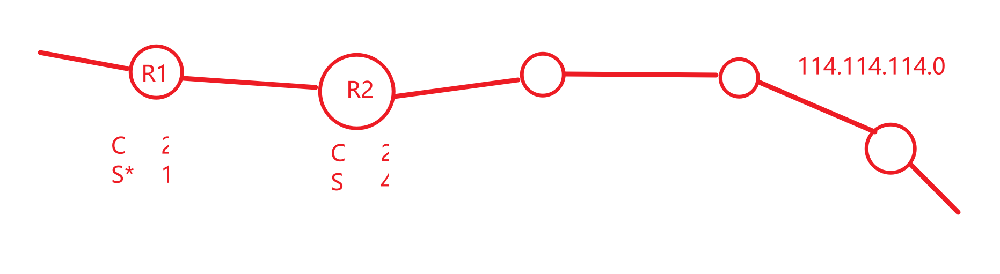


动态路由的工作原理：

路由器之间相互学习，发送路由通告，通常有两种方式【组播，广播】，  通常是告知相邻路由器

两种方式：

1	距离矢量类DV


128路由器串联，每次路由宣告间隔30s，为了避免路由表统一时长过长【路由收敛】，  通常动态路由协议  最多16个路由【450秒】，   如果路由器接口断线， 则会将跳数更新为  16跳【不可达】，通常可以通过  水平翻转【防止环路发生】，   使用保活计时器防止路由出现抖动。


课堂练习：    构建一个串联的 4路由网络，配置基本IP

RIPV1   采用广播方式宣告路由

RIPV2	采用组播地址    224.0.0.9宣告【推荐】


距离矢量路由协议缺陷， 路由收敛速度慢 ，衡量标准只根据跳数


2	链路状态类LS

区域指定一个  主路由收集区域内路由信息，   由主路由向外宣告自己的网络拓扑，  接收其他网络拓扑，  自行计算路由【收敛速度快，成本高】


路由器的id通常是回环地址，  回环地址通常用作远程管理路由器

二层交换机可以配置ip，配置给vlan，只能用作管理地址


网络层主要协议：

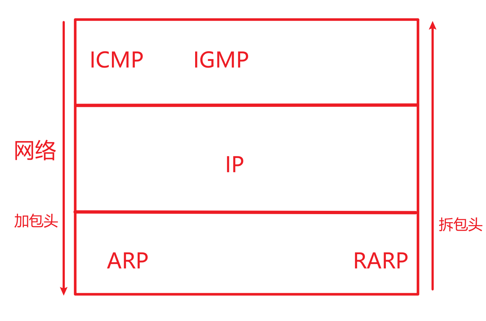

ping     测试网络双向联通性的，发送ICMP包，通常有2个类型（0，8）

-l		65500   指定发送的包大小

-t		持续

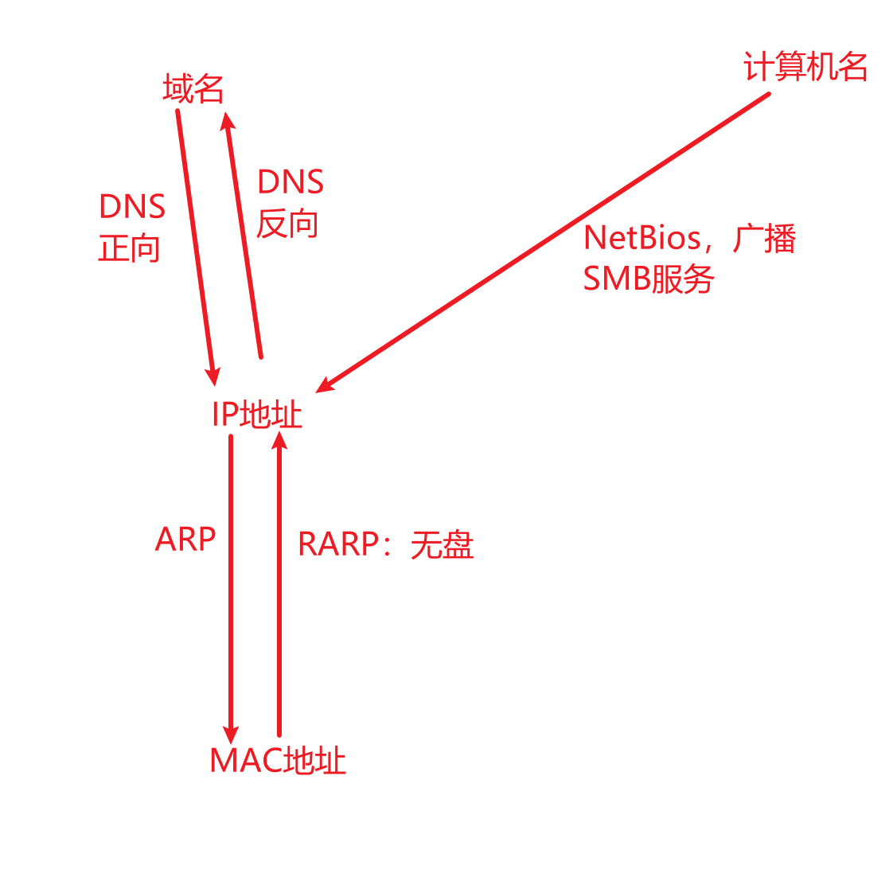

# 传输层

负责端对端业务，只需要关心发送和接收两端，中间过程不考虑。

主要实现协议有     TCP，UDP

TCP：传输控制协议，可靠的，面向连接的，数据流，全双工   ，稳定的服务器需要TCP

UDP：User  Datagram    protocol用户数据报协议，     不可靠，非面向连接，数据报   ，实时通信用UDP   ，如果下层不能确保可靠性，则可靠性由上层负责

TCP协议

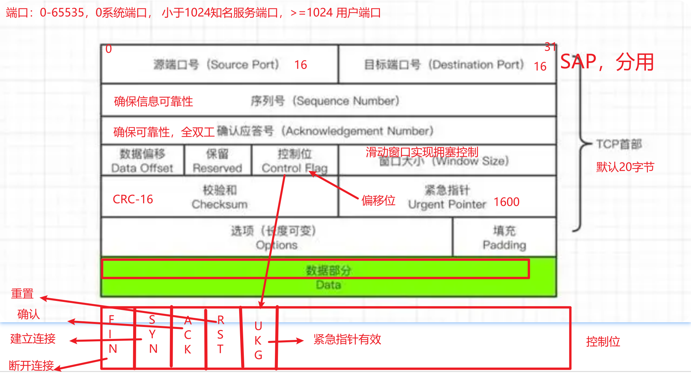


TCP工作流程

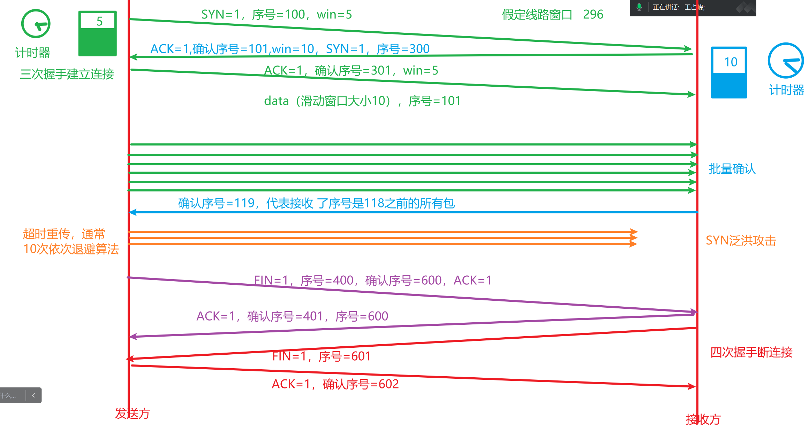


课堂实践： 使用网络抓包工具  tcpdump,iris,fiddler, wireshark     浏览器地址栏输入     http://search.dangdang.com/?key=tcp+ip&category_path=01.49.00.00.00.00      描述按下回车后工作过程，通过包分析  联通过程以及  携带的关键字   ：通过MD格式按组提交


# 通过TCP实现通信

参考思路：   一切皆文件


如何实现：C或C++【建议】


# 应用层服务

通用终端，HTTP，DNS，邮件 ，  ...................................


实现HTTP+DNS服务，   都是基于    C/S   结构的， 

基础平台：   虚拟机 + 虚拟系统（windows2003 server）  

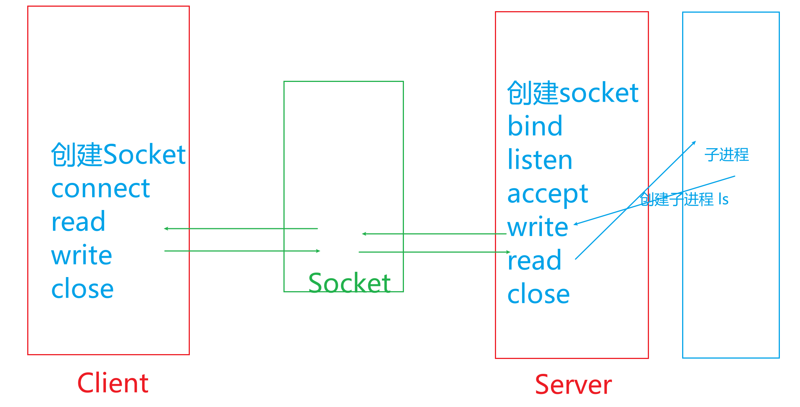

通用的服务，使用开源的已成型。

操作系统： 负责   会话层，表示层，应用层  ， 以windows2003为例

实现HTTP服务器：

1	HTTP，超文本传输协议，明文传输，典型的C/S结构模型，C使用了通用的客户端{浏览器}，被称为B/S结构，HTTP包头含有

1.1	方法，   GET，POST，OPTIONS，DELETE，PUT   代表一种操作，   语义化编程

1.2	状态码【通用】，2xx  成功   ，  3xx路由，4xx资源错误，5xx服务器程序错误

1.3	结合MIME（多用途的internet邮件扩展————扩展名）处理文件

1.4	无状态协议

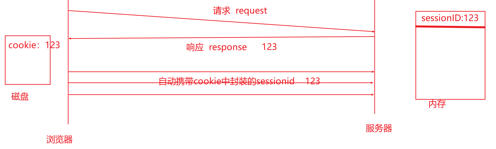


2	HTTP服务器的实现

选择   ：     IIS，      Apache    ，   Tomcat    ，   Ngnix      ，     IIS是windows服务器系统自带功能， 通过添加删除windows组件    ，  安装   IIS   （Internet   Information  Service）


3	web站点有3种形式【一个服务器运行多个web】

3.1	不同ip地址

3.2	同IP不同端口

3.3	同ip同端口不同主机头


课堂实现：   通过同ip同端口不同主机头实现，在客户端   访问    www.a.com    www.b.com     ，   通过修改客户端   hosts   文件实现静态的域名和Ip的映射关系

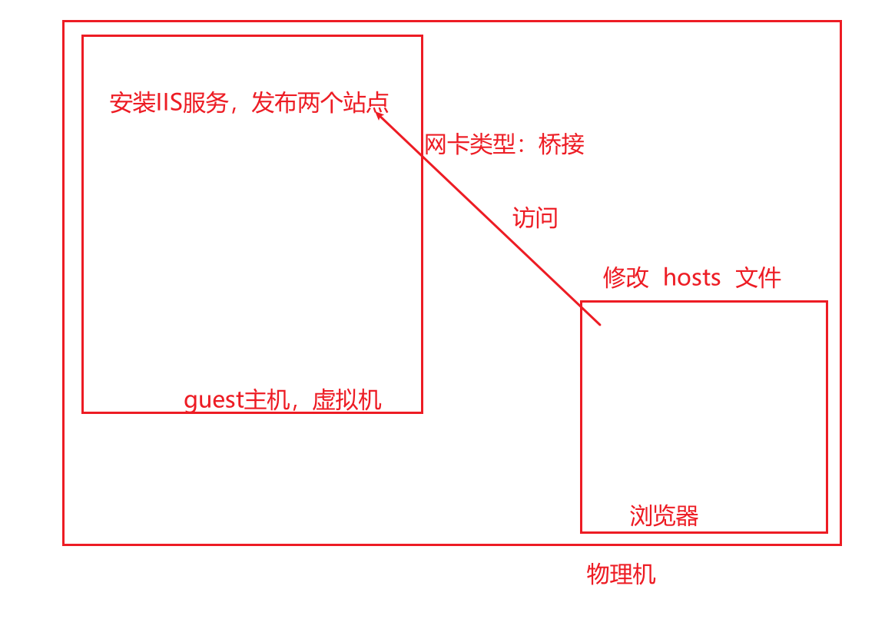


虚拟机克隆实现多个windows系统后，  需要更改计算机名称，必要时需要更改   SID


所有的访问者都得修改hosts文件   ，  应该通过DNS取代

# DNS

Domain  name   server  域名字服务，负责   域名和IP的相互映射

DNS采用   分层   分布式   数据库方式

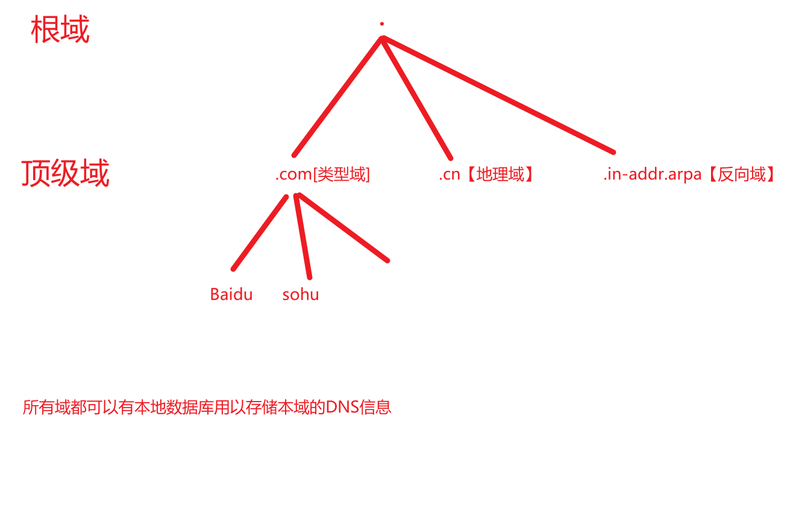


DNS的解析过程

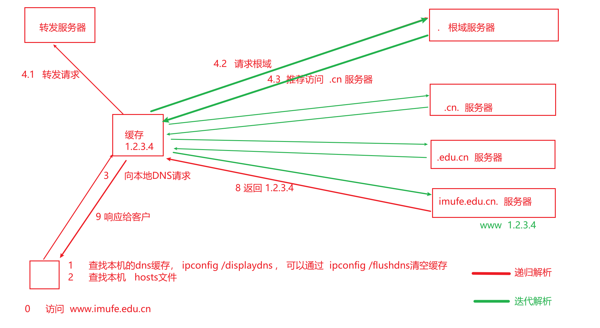

## 实现DNS服务器

1	安装

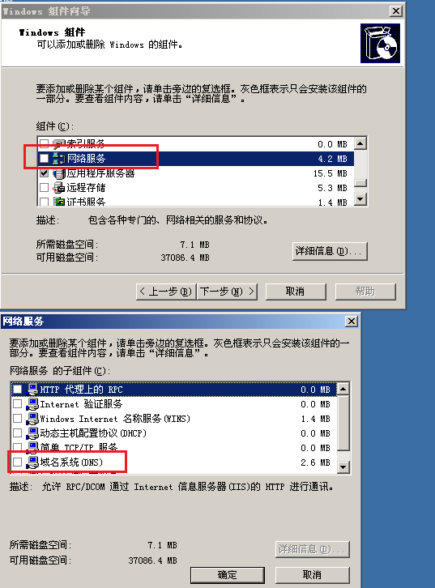

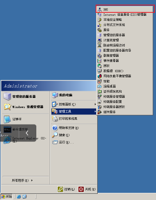


2	配置

主要区域：负责区域数据的编辑【增，删，改】，

辅助区域：主要区域的备份，可以和主要区域负载均衡，

主要区域到辅助区域的同步称为  区域复制   ，  使用TCP的53端口

DNS的默认请求使用  UDP   53 端口 

DNS域名的构成：    点分逆序，256字符，64分层 


开启客户端进行测试

1	配置本地DNS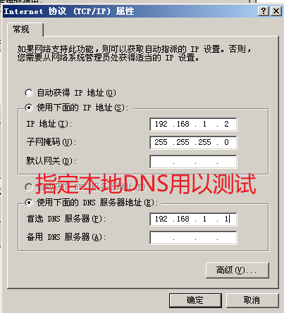


## DNS客户端测试工具

ping   ：   ping   www.baidu.com

nslookup :        

1	直接方式

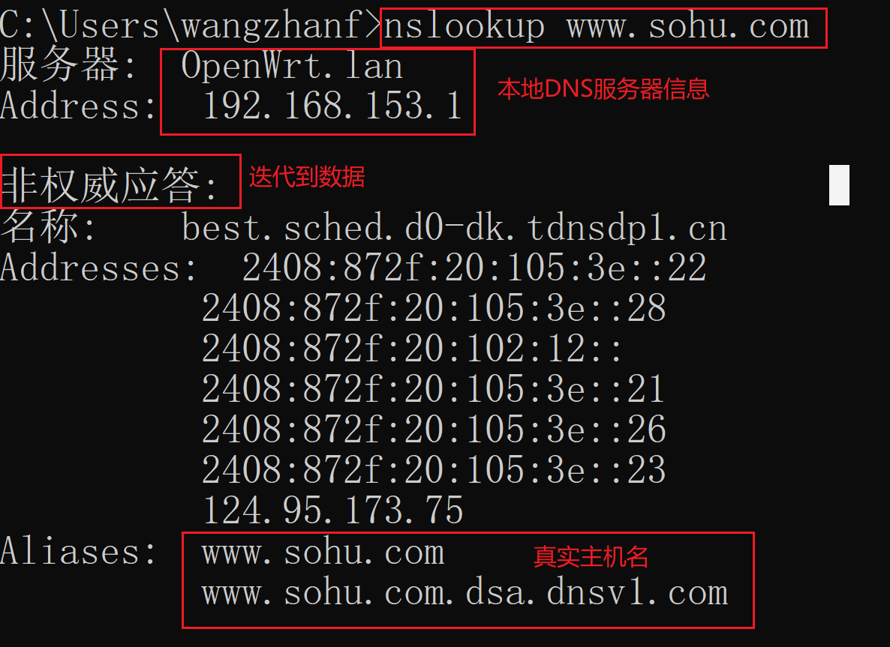

2	交互方式

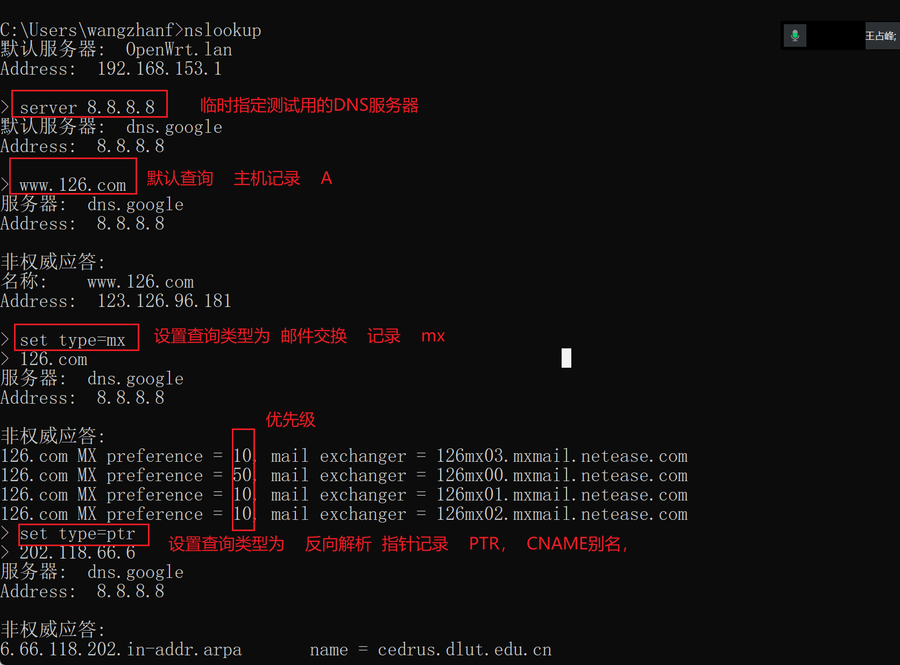


# 大作业

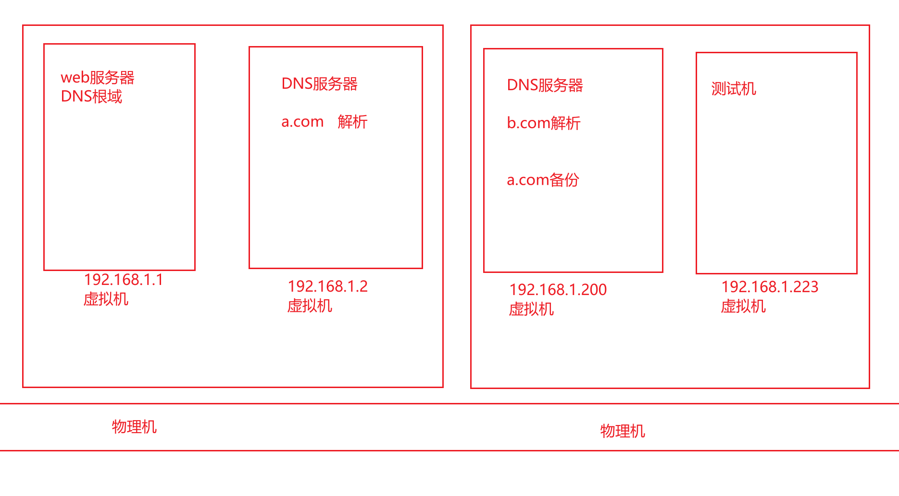


# 如何确保服务器安全

网络安全使用防火墙

数据的安全【加密，权限，备份，存储】

安全审核等级：D，C1，C2【用户隔离--DAC--MAC】，B1,B2,B3,A1,A2

## 权限管理

权限管理基于  sid（windows的安全id）  或   id（类unix系统）

1	课堂实验：    创建一个普通用户【隐藏用户】   ，使其拥有超级管理员权限  。让一个普通用户拥有root的权限。

1.1	通过   net命令可以执行  网络操作

1.2	windows中 ，$结尾代表   隐藏    ，    例如   C$   默认的隐藏共享， 建议关闭  

1.3	windows中，  用户信息储存在   c:\windows\system32\config\sam   文件中，   注册表中    HKEY_LOCAL_MACHINE\SAM\SAM   中


为了便于权限分配，   通过组给用户集体授权，    组的权力会被组内用户继承。    

复合授权过程：  用户可以属于多个组， 用户的权限是多组权限的复合，权限有冲突，拒绝最大。


linux授权机制：   

用户管理【userXXX】，组管理[groupXXX]，  文件所属管理【chown，chgrp】，权限管理【chmod   ， augo用户助记符，+-=  赋权操作，  rwx权限助记符 ，   可以使用   8进制处理   】


小组作业：  

公司  com   ，拥有  两个部门   sales和market   ，  其中user1，user2属于sales组，  user3，user4属于market组，    所有用户可以完全控制自己的目录，只读访问部门公共的目录   ，   管理员  admin  维护部门公共目录   。


实现逻辑：  windows截图体现   ，  linux 通过shell脚本体现   


用户是使用资源的主体，采用授权原则【DAC自主访问控制，MAC基于标记的强制访问控制，RBAC基于角色的授权-不能再授权】，   控制对资源的访问

用户名称仅用于人类识别， 鉴权识别   sid   ，    id   ，   伪造超级用户身份

文件权限的分配：  确保支持权限系统【NTFS ，  EXT】，权限由两个部分构成【本地文件权限--NTFS，EXT+共享权限CIFS，SMB】，权限可以被继承，权限有冲突，拒绝最大


创建新文件的权限默认由   umask  设置  


# 存储

硬盘【机械，固态】

固态：电子存储模式，快，读写次数受限

机械：适合长期存储， 价格低，高转速磁盘提供性能


机械硬盘的存储机制

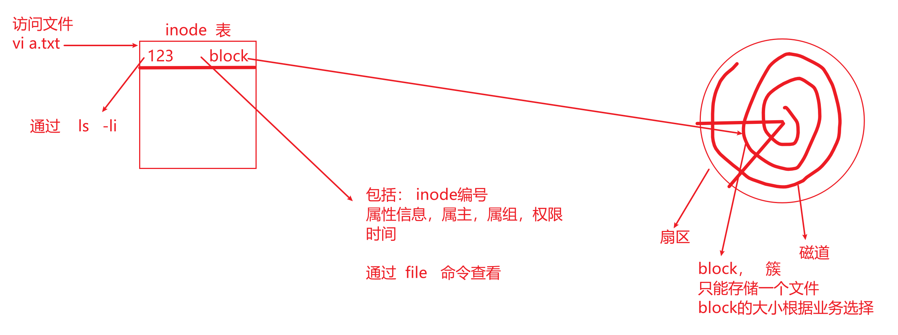

查看文件详情信息， 可以使用   stat命令

截止：   10：00

可以使用    软链接和硬链接进行文件管理

软链接和原始文件是两个文件，通过引用关系关联，inode编号不同，原始文件不存在软链接失效，软链接可以跨磁盘存在   ，   ln   -s   创建软链接

硬链接是通过不同位置或者不同名称访问同一文件的方式，  一个文件记录了多个文件名， links 为 1的时候再删除则从磁盘清除文件， 添加硬链接links+1，删除则-1   ， 不能跨磁盘   


.	当前目录                   ..     父目录


## 磁盘管理

如果单个磁盘不能满足业务需求， 可以使用磁盘阵列组合方式实现用户需求【RAID--廉价磁盘冗余阵列】

磁盘阵列和系统连接的方式：【DAS--直连式存储   ，   NAS-网络存储（接入标准TCP/IP网络）， SAN存储区域网络】


windows下   基本磁盘只能实现：分区管理【主分区<=4+扩展分区<=1  =最多 4个  】

主分区存储操作系统的引导记录，   扩展分区不能直接存储数据，需要划分为逻辑驱动器存储

如果需要实现raid模式，必须是动态磁盘。

raid的常见模式：

业务需求：   存储 蓝光光盘大小   48G  xxx.iso    

raid-0【降级版】   模式，   跨区卷模式 ，   合理组合多个磁盘的空闲空间为一个大型空间，  多个磁盘空间可以不同，线性存储模式，可靠性低。可用空间=贡献空间*1

业务需求：   要求快速   读取写入  数据【无盘站服务器】  

raid-0模式，     带区卷模式，多个磁盘共享相同大小空间，分布式存储，平均划分存储，读写速度最快 ，   可靠性低  ，可用空间=贡献空间*1

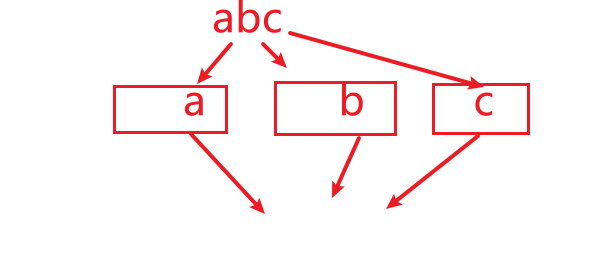


业务需求：  确保数据可靠，不应出现单点故障

raid-1模式，     镜像卷模式，   两块磁盘共享相同大小空间， 同时写入，可以分布读出，   写入速度和单磁盘相同，读出速度可能优于单磁盘。可靠性提升 ，可用空间=贡献空间*0.5

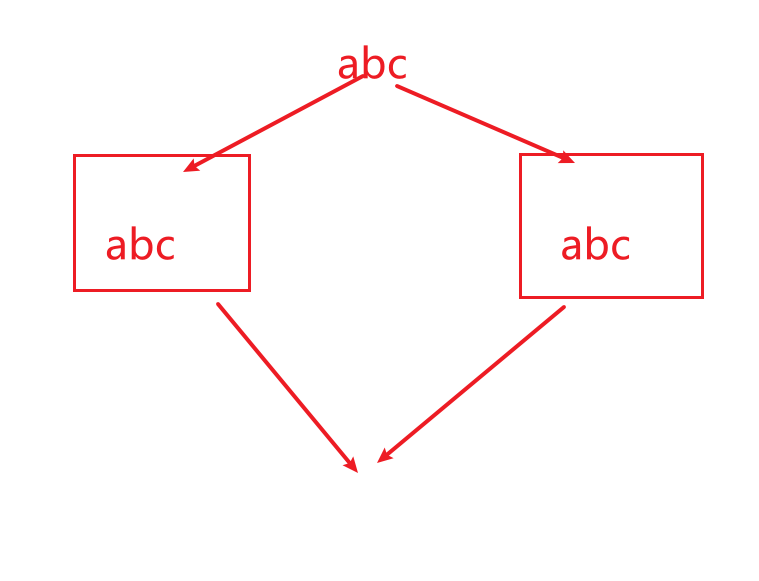

raid-3或raid-5：  多磁盘贡献同等大小空间， 利用率   可用空间   =   贡献空间*(N-1)/N,    可靠（不能同时损坏2块）

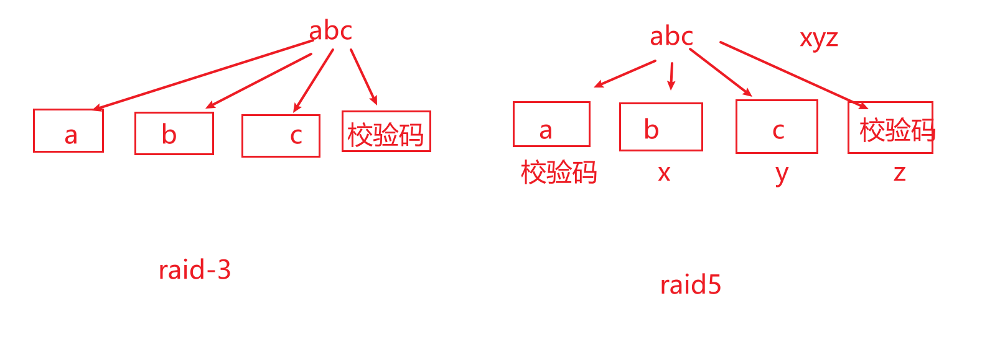


关于可靠性的计算：

MTBF =   平均无故障时间/（平均无故障时间+平均故障修复时间）

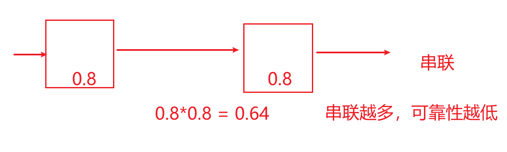


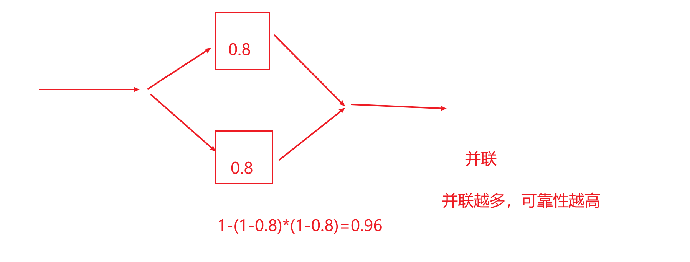


磁盘划分空间之后，   需要格式化

格式化：创建文件系统FS  ，   文件存取访问的方式叫做文件系统。   

分区，卷     其实是空间称谓，     需要通过     挂载点【c:\  盘符   ，       /root   ,  还可以使用 文件夹作为挂载点】  访问空间


研读    linux    LVM   实现动态磁盘管理   ，使用磁盘配额限制用户的可使用空间和inode数量

提交md格式文档：    linux下实现LVM+raid+磁盘配额.md      附带    组内评分.txt(每人贡献5分)       


存储，磁盘管理，DAS

分区，卷（raid-0  1    5）【特点，可靠性，利用率】，LVM+raid


通过对存储设备进行管理：   

1	raid	：  实现空间组合利用，可靠性提高

2	LVM   ：   实现空间的弹性分配

3	FS	  ：   实现权限分配

4	mount   ：   访问点

解决了部分硬件故障引发的数据安全问题，能否解决人为损坏数据？ 


# 备份策略

正常数据存储一个副本类消息， 以备损坏后恢复

tarball   结合    zip工具  

备份类型：

1	完整备份：所有数据拷贝一个镜像内容，修改存档标记【备份标记】，消耗空间最大，恢复时间长，所有备份的基础。【可以采用的方案windows提供的backup工具(文件)，备份引导记录（磁道，MBR）使用 ghost  ，  使用   linux下的  dd  ， linux下备份工具  tar（文件） 】

2	副本备份：完整备份， 不操作存档标记【备份标记】

3	差异备份：备份和上次完整备份之间差异的部分，不修改备份标记，恢复时使用  完整备份  +   最后一次差异备份。

4	增量备份：备份和上一次增量或者完整之间变动的部分，修改备份标记，恢复时使用完整+所有增量【linux下tar 的   -g  选项实现增量】


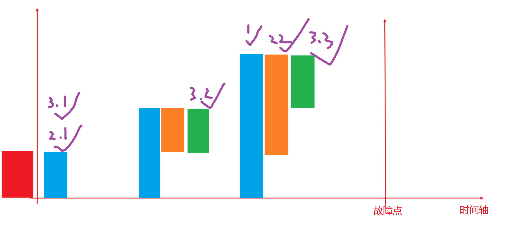


linux的命令：

[root@localhost ~]#   命令字              选项             参数

root	代表当前用户，   如果需要切换身份 ，    使用   su    switch user， 临时切换身份执行命令    sudo   

localhost   代表当前主机名称

~	代表当前所在目录，  可以通过   pwd   获取，     ~   代表用户宿主目录

命令字和选项以及参数之间用    空格   分隔

选项有两种：      -  短选项，  多个短选项可以压缩   -l   -i   -a      压缩为     -lia

​							 --长选项，   完整单词，不可拆分

ls   -R  -lia   --deeps  /

man   关键字     获取帮助信息


linux如何实现  ：    

登录时备份：~/.profile

开机时备份：/etc/rc.local

周期性备份：cron   实现   


课堂演练：     windows下实现  每10分钟进行完整备份， 每2分钟进行 增量备份，注意观察   备份标记，   模拟破坏数据然后恢复

下午演练：     linux下实现


应用层服务层面实现：HTTP，FTP，DNS，


数据管理：授权，raid，lvm卷弹性，备份

根据业务需求选择    数据管理方案。   网站  


存储安全更多的是在内部应用中体现

内网服务主要的服务对象是局域网用户，通常  DHCP   ，轻量级目录访问服务OLDP【windows 的  AD--域管理，linux下   NIS   】

windows采用网络管理形式

1	工作组模式   ：   workgroup   ，  管理方式是平等的， 非强制制约的，DAC原则 ，扁平式结构

2	域        模式   ：   domain    ，        管理方式是集中的，强制制约       ，MAC原则，金字塔结构


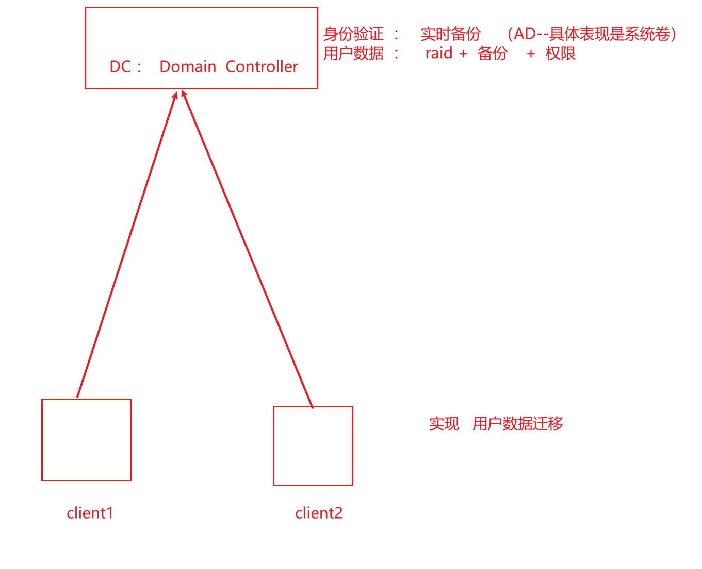


设计：

客户端需要由ip，服务器应该具备分配IP地址的能力，安装DHCP服务， 备份策略（完整+增量）

域管理需要DNS支持，服务器应该安装DNS。备份策略（完整+增量）

用户数据存放在raid5空间， 备份策略自选


DHCP工作机制

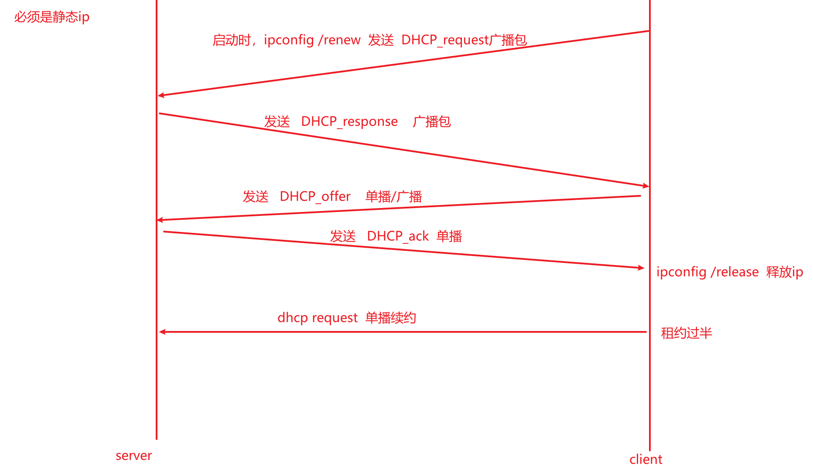


1	设置服务器为静态ip

2	安装dhcp服务


安装DC

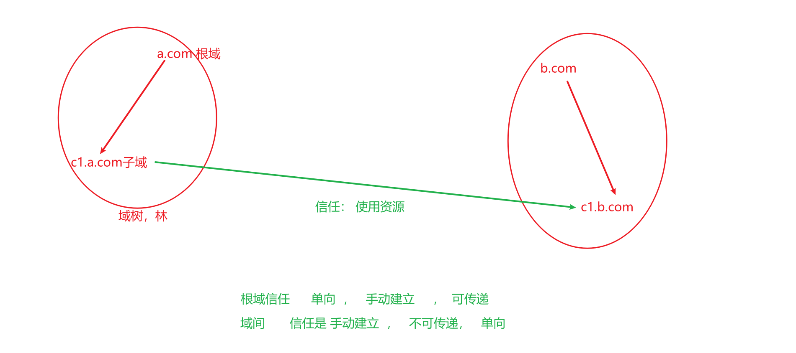


将客户机加入到域

因为 虚拟机都是  克隆的， 所以   SID 相同，   重新封装获得新的SID


放置在  raid5  磁盘中

配置用户信息， 实现用户配置迁移

共享文件方式，实现用户   网络驱动器访问共享文件【权限】


所有文件有备份


提交方式：     域管理综合实验(组内评分).zip


# DMZ安全部署

DMZ： 非军事化区域， 放置对外发布的服务

防火墙类型：

单宿主堡垒主机：【宿主--代表网络连接】


双宿柱堡垒主机：【防止外部攻击】

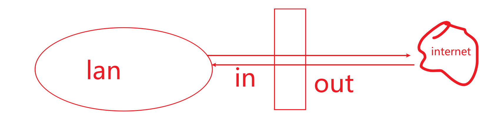

三宿主DMZ区域：

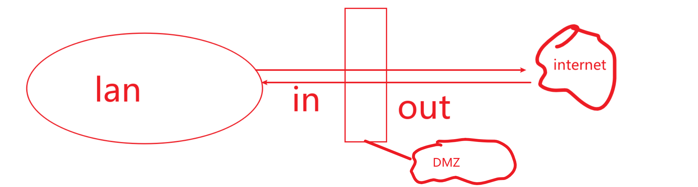

背靠背DMZ区域：

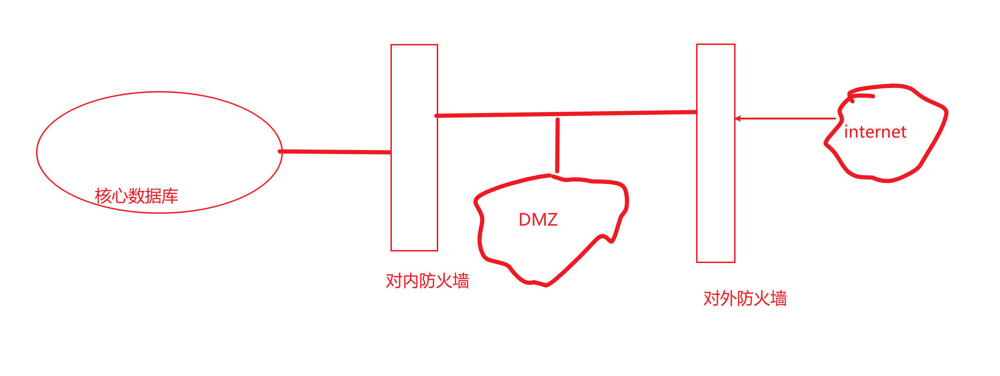

防火墙类型：

防火墙本质就是根据数据包分析，确定是否是攻击


包过滤防火墙：工作在网络层

链路状态防火墙：工作在传输层

应用代理防火墙：工作在应用层


防火墙的分类

软件类：   ipchains

硬件类：   ASIC   实现过滤， 效率高


根据业务规划防火墙：脚本化管理

假设DMZ区域提供，web服务（HTTP，HTTPS），邮件服务，DNS服务，FTP服务，DMZ内的主机通过ssh方式管理。防火墙推荐使用centos实现

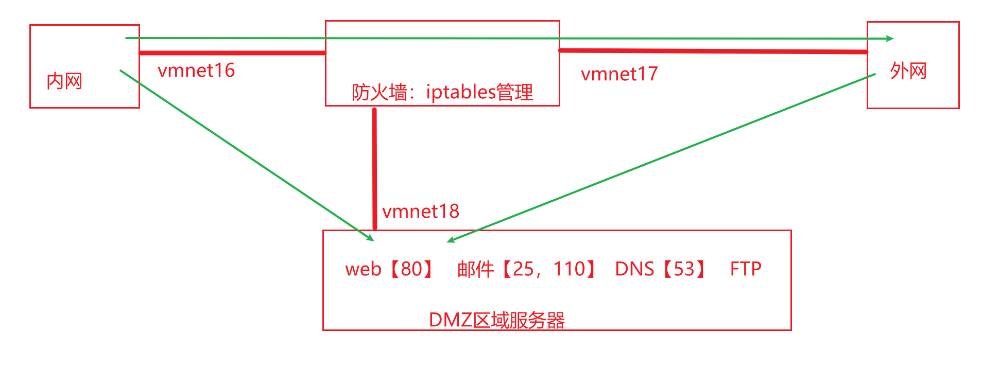


防火墙的规则中， 默认自上而下匹配，匹配到严格规则，则按最严格执行，默认最后一条拒绝所有


平台安全

应用安全


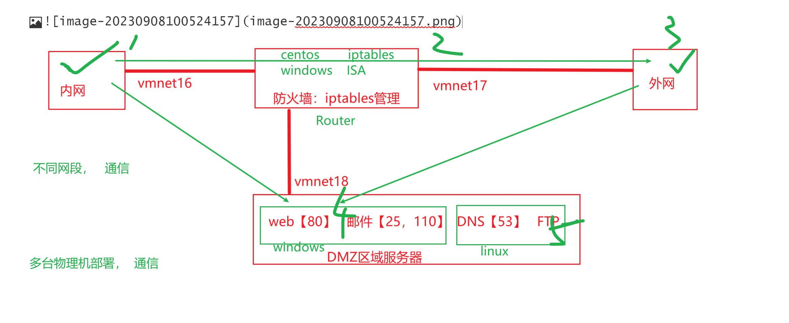


iptables结构：

netfilter内核【调用系统区】

ipchains   配置实现调用

iptables  工具编写规则

由三级组织实现： tables表，   chains链，rules规则

表：filter，nat，mangle，raw表

filter：默认表，   -t没有显式指定，则表为   filter，包含了  INPUT--处理来自外部的数据，OUTPUT-处理向外发送的数据，FORWARD【转发】，数据转发到本机之外的网络   链

nat： 网络地址转换，    PREROUTING--【prevent】处理刚到达本机在路由转发前的数据包，转换数据包的目标地址，做DNAT，用于发布DMZ的服务器，

POSTROUTING--处理即将离开本机数据包，转换源地址，做SNAT，用于内网多个私有ip访问互联网

OUTPUT链：

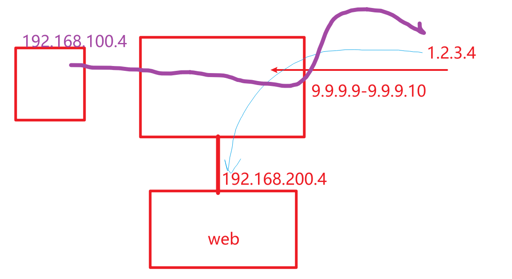

mangle表：修改数据包内容，可以修改TCP头的Qos字段

raw表：处理异常

规则Rules：

匹配的目标 Target + 处理 Action

基本命令格式

```shell
#iptables  -t  表名    选项    处理
```

基本常用命令[增删改查]

```shell
iptables --list    查看 filter 规则,  --list 等同于 -L
iptables -t nat  --list   查看 nat 规则  
iptables -A -t filter -j DROP    默认丢弃所有未匹配的包  									-A  尾部追加
iptables -t filter -P INPUT DROP 修改默认策略(predefault)实现丢弃所有未匹配包

iptables   --flush   清空已有规则， --flush 等同于   -F

```

规则的选项

```shell
all		默认的，不写代表all，【协议，ip，端口】
-p	指定协议(网络层之上)【tcp 6 ,udp  17 ,icmp  8,igmp】，对于其他应用层相关协议建议使用   端口号识别
-s	指定源ip，可以是单机或网络地址 [192.168.1.1 , 192.168.1.0/24]
-d	指定目的ip
--sport	源端口
--dport 目的端口
-i	入口接口名，    -i  ens33 ， 可以使用通配符   -i !ens33(除了ens33)   ， -i ens+(所有ens开头的接口)
-o	出口接口名
--tcp-flags 	指定TCP 标识字段【SYN，ACK，FIN，RST，URG】
--icmp-type		0，8  


```


课堂练习：  内网  192.168.100.4，DMZ区域192.168.200.5 ，  外网合作伙伴 都能通过远程登录【telnet/SSH】(putty，xshell)实现对防火墙的管理。  

```shell

```


iptables的规则   CRUD

-L	--list	列出

-A	--append	追加

-I 4   --insert       插入到第4条

-D	--delete	删除

-R	--replace	更新替换


NAT转换

1	开启转发功能

echo 1 >  /proc/sys/net/ipv4/ip_forward

2	开启端口转发

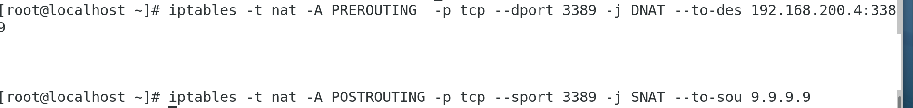

3	开启转发规则

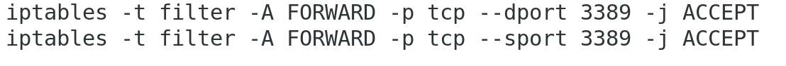

4	建议通过日志进行调试

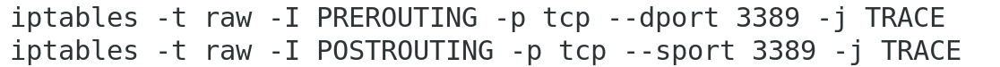


linux虚拟机安装软件

1	修改虚拟网卡类型为桥接模式（物理机网卡连接到非DNUI-CUCC）

2	通过ifconfig可以看到获得了和物理机网卡同段的IP地址

3	进入虚拟机执行如下命令实现修改源

```shell
mv /etc/yum.repos.d/Centos-Base.repo /etc/yum.repos.d/Centos-Base.repo.bak
wget -O /etc/yum.repos.d/Centos-Base.repo http://mirrors.aliyun.com/repo/Centos-7.repo
yum upgrade
yum update
```

4	通过yum工具安装软件即可

yum -y install xxxxx


回顾：

网络拓扑安全结构：动态路由（负载均衡，动态线路切换），VLAN（通过路由转发，STP线路冗余和负载均衡）

系统安全：用户安全， 文件权限【DAC，MAC，RBAC，ACL】

存储安全：存储方式【DAS，NAS，SAN】，存储可靠性和效率【Raid+卷管理】，备份策略（依靠备份标记）【完整、差异、增量】

防火墙：  netfilter       实现NAT，包过滤，伪装

数据传输的安全：安全加密


# 安全加密

确保数据的  保密性，完整性（可用性），真实性（交易的不可抵赖）  性质

防范     窃取  ，修改  ，中断  ，伪造    攻击

采用的手段：加密

常见的加密手段：    置换【P@ssw0rd】，   易位 【A->e】    

常见的加密类型：


综合应用解决问题：   HTTPS，      PGP 【工作流程】

 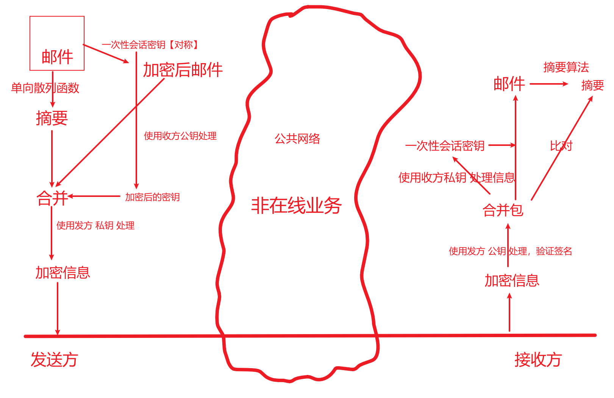


如何解决密钥的管理和分配问题

使用通用结构      PKI        公钥基础结构   ，  权威的认证CA机构负责审核，认证，分发 证书。结合  RA 权威注册机构， 协调  申请 ，初审。  使得    服务器   和    用户    身份验证。


对应关系：

CA+RA     =    windows  证书服务

服务器     =     IIS   发布   HTTPS（HTTP+SSL）服务  

用户         =     安全访问（证书）


参考：     windows   IIS   使用证书     

1	windows证书服务通常是依赖于  web服务器进行发布的【在线处理】，支持ASP

2	收集用户信息

3	证书导入到服务器


# windows证书服务

1	安装IIS附带   asp   扩展


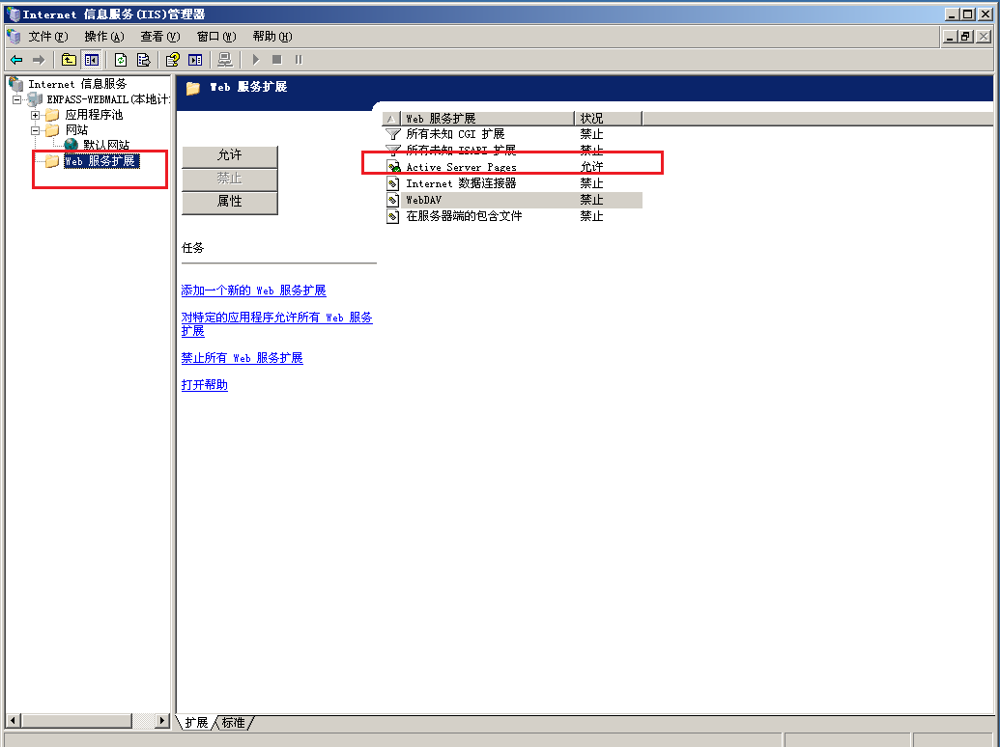


2	安装证书服务

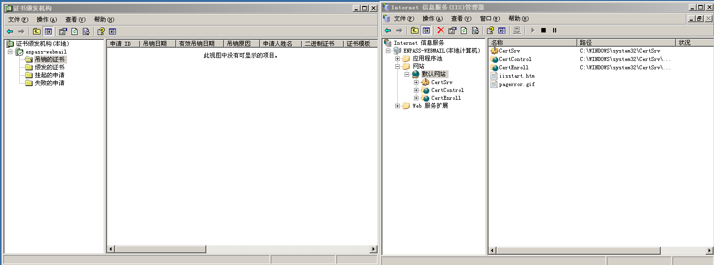

3	访问证书系统页面，利用虚拟目录访问

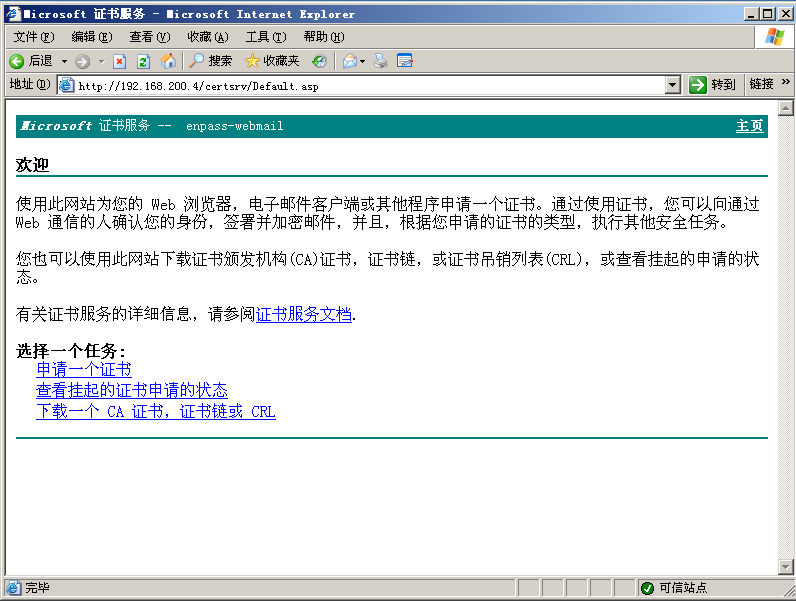


4	申请个人证书【浏览器证书】

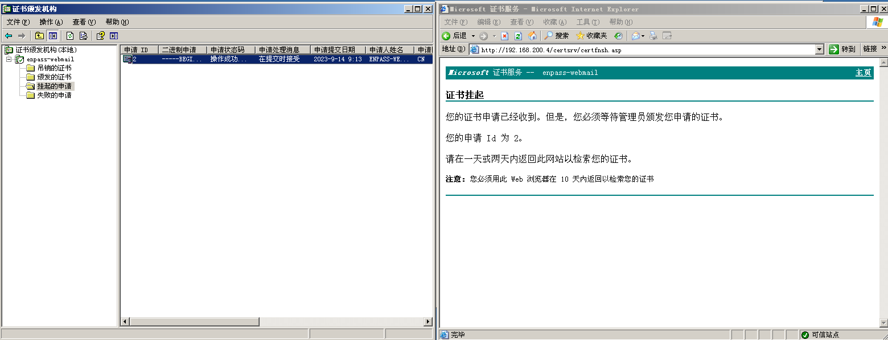


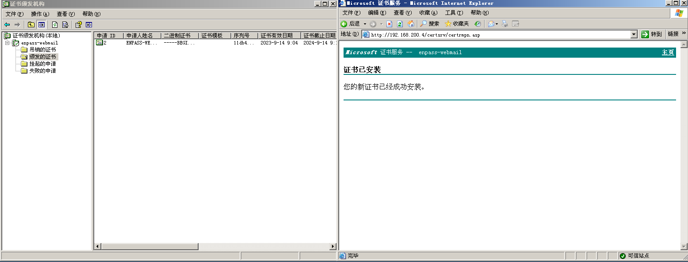

5	服务器证书的使用--申请

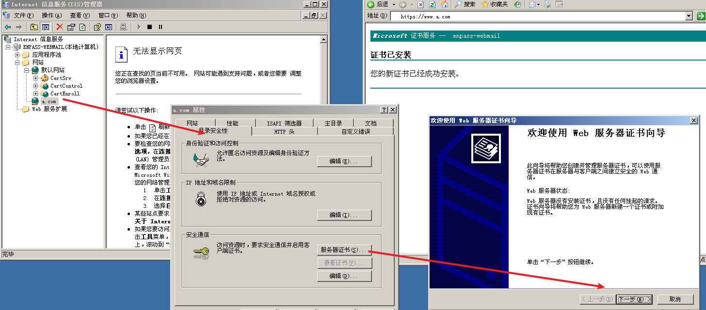

6	服务器证书的使用--颁发并且导出

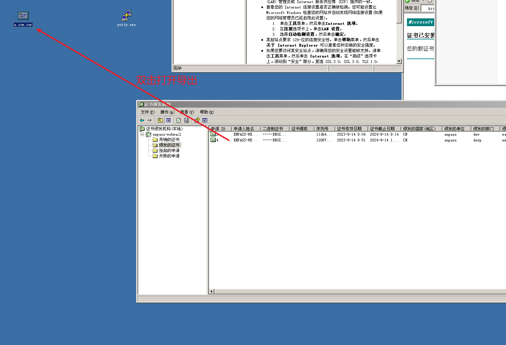

7	web服务器导入即可


毕业设计：

原则：   基于基础研究的实际应用，    思路整合    入口和出口

自拟题目：下周一上课前提交【送审】，通过  撰写   开题报告


# linux搭建DNS服务

## 1	联网

IP设置：1  命令行方式      【当前启动时生效】， 2   配置文件方式【终极方案】

```
#ifconfig ens33 192.168.153.233 netmask  255.255.255.0
#route add default gw 192.168.153.1
#vi /etc/resolv.conf
添加一行     nameserver  192168.153.1
```

## 2	修改yum源

略

## 3	安装named服务【BIND】

```shell
#yum install -y bind bind-chroot  bind-utils
#yum install -y bind bind*
```

## 4	启动named服务

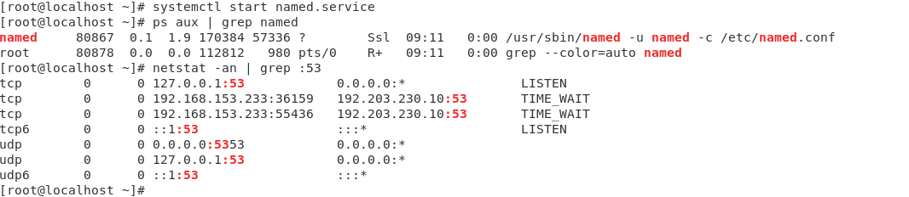

## 5	named 配置文件

/etc/named.conf    主配置文件

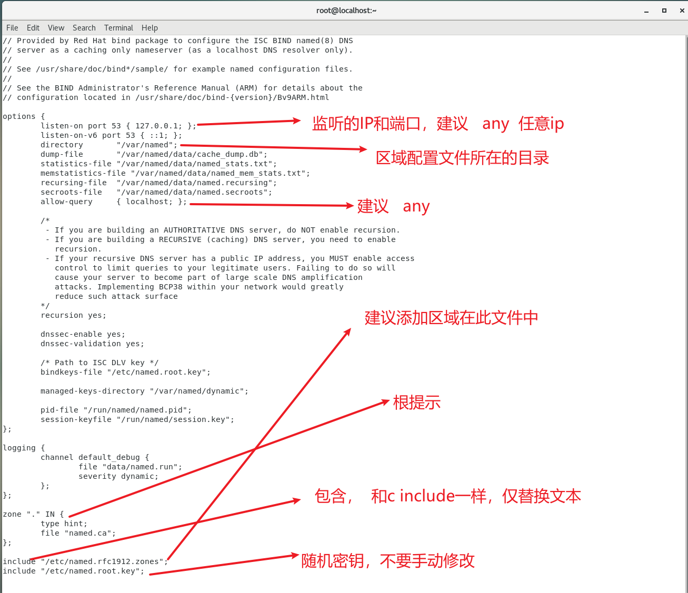

添加区域可以在     推荐的  rfc1912文件进行，  改动前先备份   

 ```shell
#cp -p  /etc/named.rfc1912.zones /etc/named.rfc1912.zones.bak
 ```

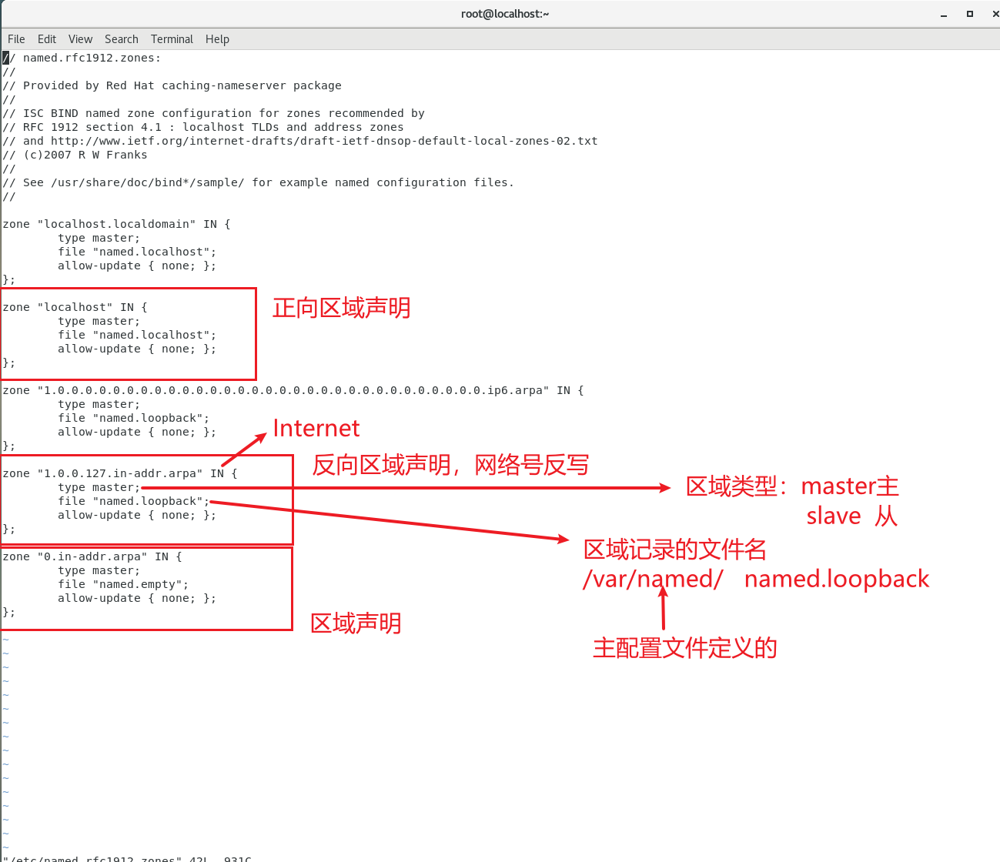

添加区域声明

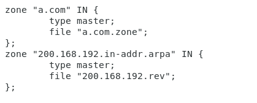

## 6	编写区域记录

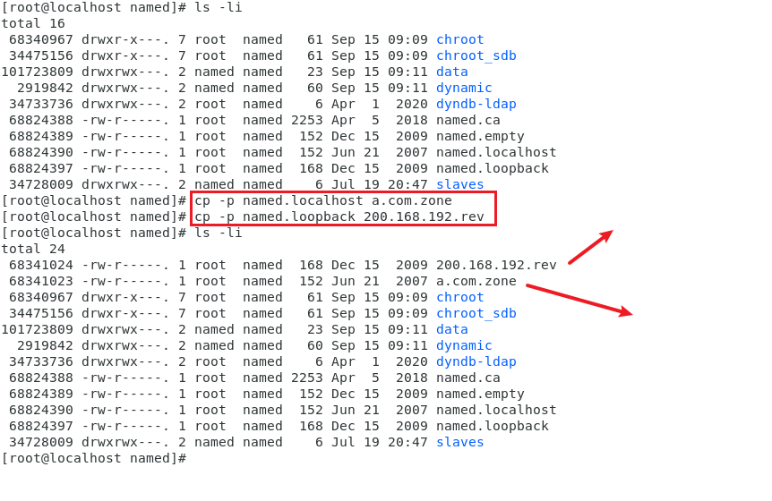

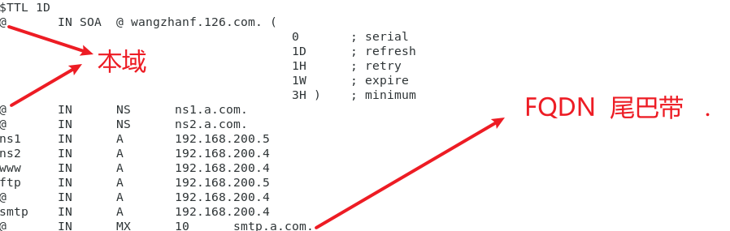

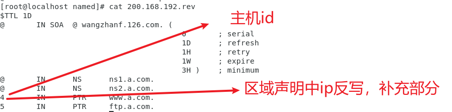

## 7	启动服务【restart ，   reload】

```shell
# systemctl   restart  named.service
```

## 8	使用客户端工具检测【ping，nslookup，dig,host】

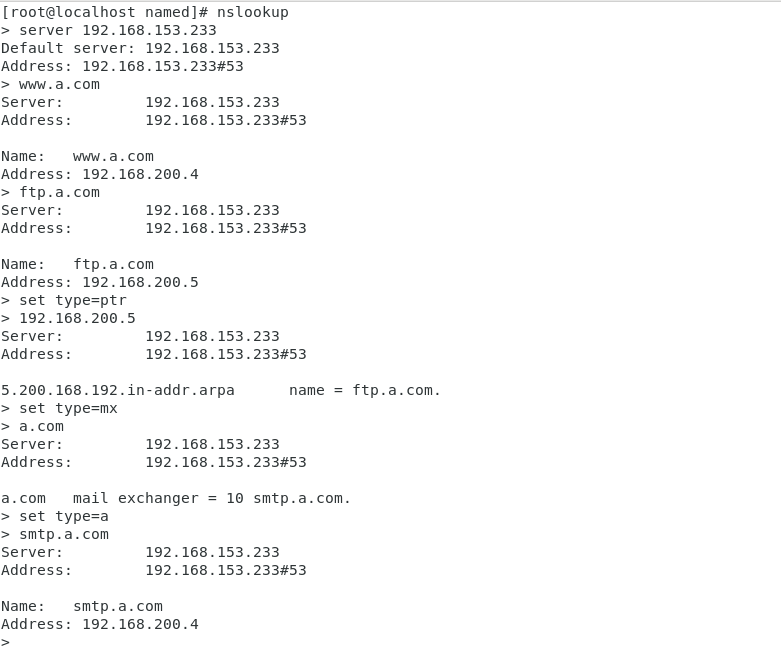


# 性能监控和设计

网络，系统，应用

## 网络性能

利用常见工具获取监控信息

ifconfig    , ping      ,  traceroute     ,    netstat      

结合   SNMP  等网络管理协议实现


## 系统性能

关注系统级别的管理： 进程管理，存储管理，设备管理，作业管理。

### 进程管理：

程序的执行过程，使用计算机资源的单位，分配资源时以进程为依据。每个进程都认为自己独占CPU资源。记录当前运行的状态信息到PCB。

1	进程查看

windows查看进程方式：任务管理器

linux系统查看进程方式：ps,    pstree，top

2	进程的控制

windows通过任务管理器可以控制进程

linux中对进程采用发送信号方式进行控制， 常见信号有32个，可以通过 kill -l  查看 

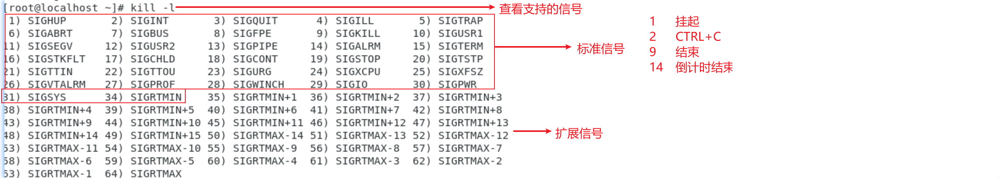

linux  中  给进程发送信号使用    【shell命令（kill -信号  PID），  设备调用系统发出ctrl+c，用户程序（kill()系统调用）】

3	进程的创建

3.1	执行程序，   top   ，  sleep  ，  创建的新进程都会是 shell的子进程

3.2	用户程序中使用    fork产生子进程

3.3	用户程序中使用     exec   产生进程调用


3.1	执行程序

shell的基本特性：  

使用位运算符/逻辑运算符  实现执行逻辑  ，   &&    || ,使用   ;   实现一行执行多个命令  

标准输入是  stdin--0--键盘             ，可以利用     <   重定向

```shell
cat <  /dev/input/mice  
cat < /dev/input/event1
```

标准输出是    stdout--1--屏幕			，  可以利用    >  替代     >>  追加   重定向

```shell
cat < /dev/input/event1    >   ~/key.txt
```


标准错误是    stderr--2--屏幕         ，    可以利用    2>  重定向

```shell
shfalkdsafkasfkasfd    2>   err.log
```


|	管道   ，   将前一命令的输出作为后一命令的输入

```shell
cat /etc/passwd   |  grep "^a"    |   wc   -l  
```


课堂作业：  运行自己编写的脚本   ，   获取  30秒内，每隔3秒系统的状态信息（top），统计信息的记录数。 

```shell
#!/bin/bash

top -d 3 -n 10 -b >> list.txt
cat list.txt |  grep "bash"  | wc -l
```


linux下的         /proc    文件系统

/proc是内存的映射，    用户和操作系统交互的接口，    查看进程类信息时本质上就是读取  /proc内容   ，   内存断电数据消失，/proc断电数据消失【无需备份】

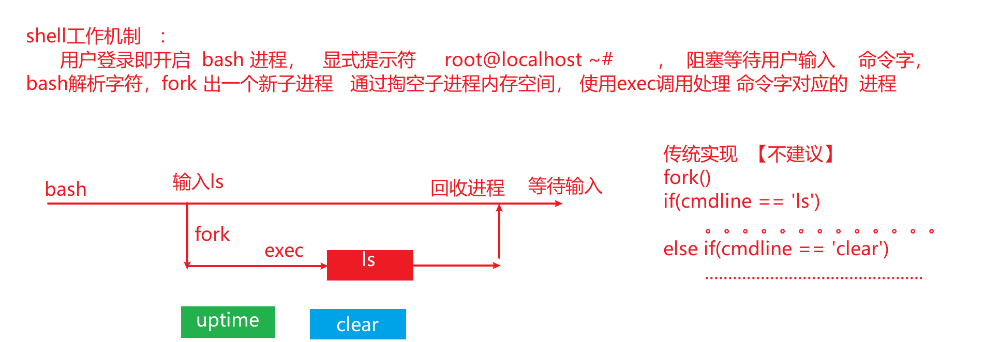


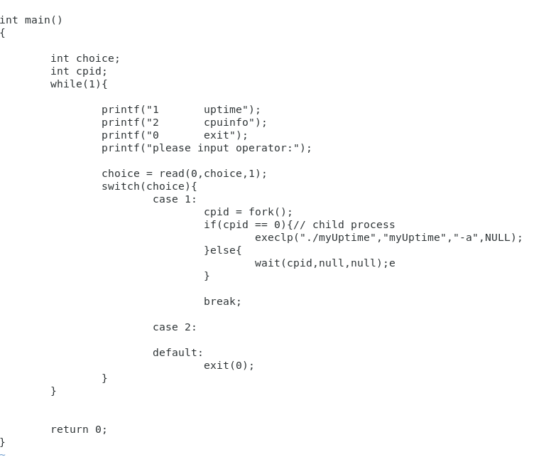


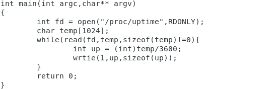


# 试验任务：实现自己基于console终端的监控工具

## 1	安装gcc

gcc 工具链（套件）， 包含编译器，预处理器，汇编，链接  ， 可编译c，c++，java

```shell
查看版本
#gcc -v
#yum install -y  gcc
```


gcc的基本使用

```shell
gcc  源文件1.......   -o   目标文件    
gcc  源文件   -I头文件位置   -L库文件    -o    目标文件
```


vi :     vi   -o2  文件1  文件2     同时编辑多个文件， ctrl+w跳窗口

## 2	构建工具结构

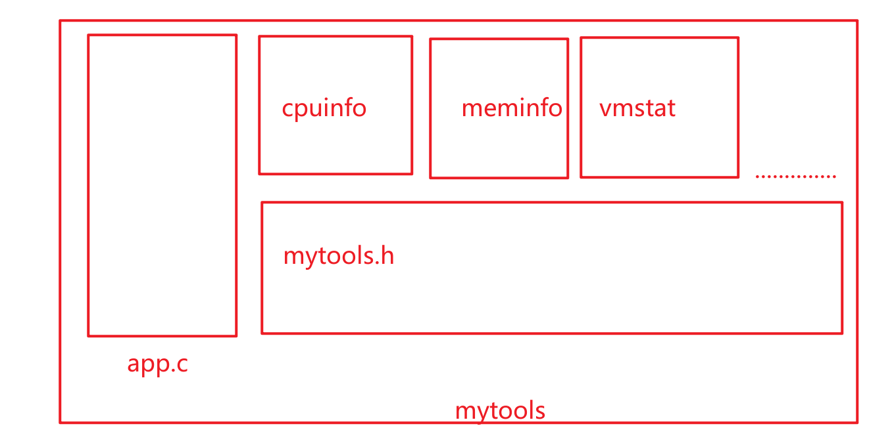


建议给头文件都加上守卫

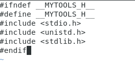

验证环境的正确性

## 3	编写子项功能

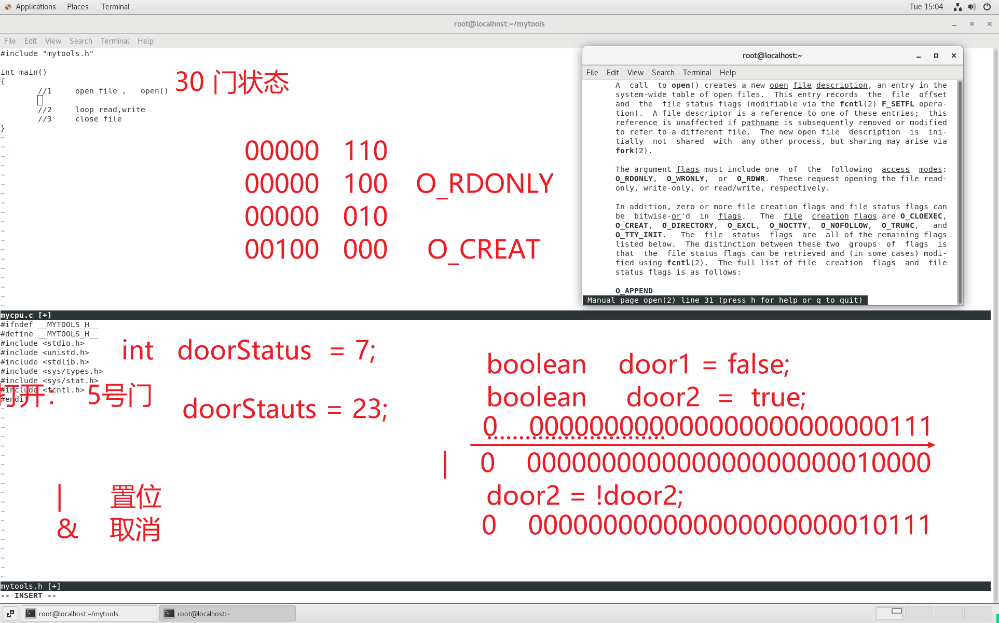

mycpu.c为例

```c
#include "mytools.h"
#define LEN 512
int main()
{
	//1	open file ,   open()  
	int cpuFd = open("/proc/cpuinfo",O_RDONLY);
	if(cpuFd == -1){
		perror("open error");exit(9); 
	}
	
	//2	loop read,write
	char buff[LEN];
	ssize_t nread=0;
	ssize_t nwrite=0;
	while((nread = read(cpuFd,buff,LEN)) > 0){
		nwrite = write(1,buff,nread);
		if(nwrite == -1){
			perror("wrtie error"); exit(8);
		}
	}
	//3	close file
	close(cpuFd);
}

```

## 4	编写界面类  app.c


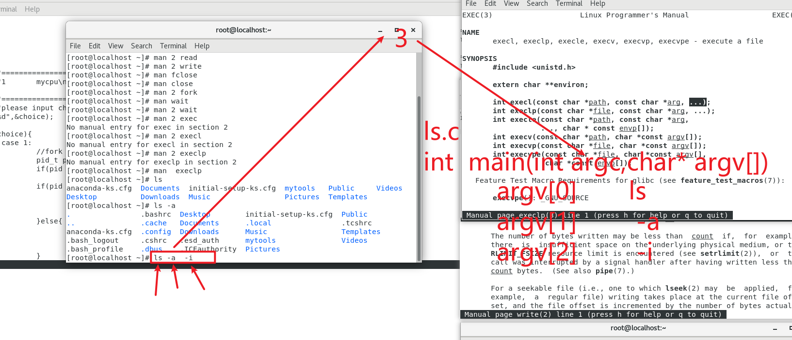

```c
#include "mytools.h"

int main()
{
        int choice = 1;
        while(1){
                printf("===================mytools===================\n");
                printf("1       mycpu\n");
                //
                printf("==============================================\n");
                printf("please input choice:");
                scanf("%d",&choice);

                switch(choice){
                        case 1:
                                {
                                pid_t pid = fork();
                                if(pid == -1)
                                        exit(7);
                                if(pid == 0){//child process
                                        printf("this is child process\n");
                                        //exec  user define process
                                        execl("./mycpu","mycpu",0);
                                        printf("child........................\n");// nothing
                                }else{
                                        int ok = 0;
                                        pid_t rpid = wait(&ok);
                                        printf("child finished, current parent\n");
                                }
                                }

                                break;
                        default:
                                printf("Bye\n");
                                exit(0);
                }
        }
        return 0;
}
     
```


# vi使用

unix体系下**通用**的文本编辑器，目前使用   vim  取代   vi   ,    vi 是vim的别名

```
#  yum  install -y  vim
```


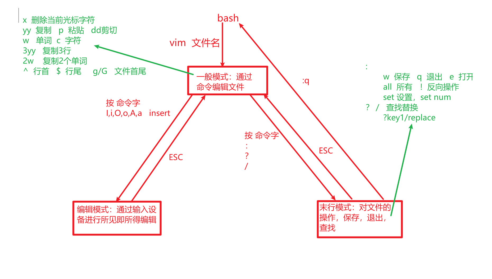


# 作业管理

用户层面排队使用资源，通常消耗大量cpu和内存资源

如果安排作业在   后端运行【不占用终端窗口】    ，   命令字  &

```shell
#ping  www.baidu.com &
```

可以通过  fg   bg实现作业的管理

fg  序号   ：   将后台作业调度到前台

bg	序号：   将前台作业调度到后台

采用   kill     终止任务     ，   kill    信号   pid


希望的掌握程度：

1	简单利用系统监控工具实现性能监控，top   ps  vmstat    任务管理器

2	系统状态接口（/proc）  ，  开发自己的性能监控工具

3	使用已知的系统性能监控平台实现   ，windows  下的   “性能”   工具  ，linux整合平台

4	开发自己的整合工具平台【基于http应用，基于GUI应用（Qt实现）】


课堂检测：    实现一个简易版计算器的设计，灵活的进行单目，双目（+，-）运算，只要运算都会有结果产生， 弹性添加功能（*，/）。

课后任务： 9月20日晚  17：00    提交      linux下性能工具作业