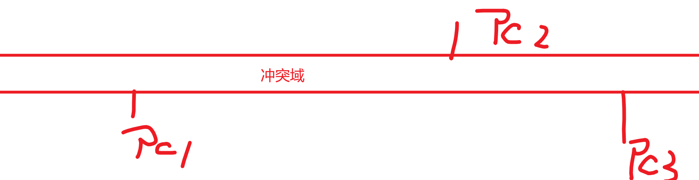

# 王占峰

## 计科：项目管理

# 1	摸底测试

不做任何考核依据，   1小时 ，    只做    1-5，11-15，21-25..............

# 2	项目

为了得到某种  产品  、 服务、 成果 而付出的  临时的  一次性努力。

## 项目特点

临时性：有开始时间，有结束时间， 项目追求结束

独特性：其他项目的资料可以借鉴，而不能直接复用。

渐进明细性：随着项目的推进逐步细化过程

## 项目管理

项目管理综合利用   技能、管理技巧、行业标准、人际关系   实现项目目标

通用的过程：Plan      Do        Check Action

### 人力资源的管理

P：制定人力资源管理规划：定宗旨 ，选标准 ，如何实现标准。确定角色和职责

D：组建团队：   事先分派，谈判，招募，虚拟团队。  从0到1的过程

CA：建设团队：从有到优过程，提高团队绩效，提高个人能力

CA：管理团队：管理冲突

优秀团队的标准：

共同目标

明确自己对目标的贡献

明确的责任划分 RACI 原则

有行之有效的工作流程以及互相学习的环境【结对】

有冲突解决方法

熟悉不同的组织结构对项目的影响：

项目型结构和职能组织型结构：

分组实现任务，每8人一组，每组一名leader

推举一名leader，作为直接**管理**者身份参与

作为一名leader整个项目团队的负责人，考核加权值较高

应该拥有哪些能力：

​	通用的管理技能【KPI】

​	应用领域的知识标准和规定

​	项目管理的技能知识【成本、进度、质量、风险】

​	良好的沟通和协调能力

构建一个顺畅的沟通渠道。简单的沟通【微信群】，复杂的文档【Git】。

课堂实践：   30分钟， 成果物   提交   推选leader的过程【理由】以及决议，截止14：25

# 沟通的认知

沟通的目的  共享信息

沟通存在障碍的： 

​	认知障碍：同源信息的不同理解，无歧义的描述

​	语义障碍：不同干系人经历以及环境

如何做好沟通：

​	主动沟通

​	了解对方的沟通风格和沟通方式

​	采用对方能够接受的共同手段【头脑风暴，纵向，横向思维法】

文档为何需要沟通，组内共享编辑，组外发布。

# 配置管理

事物的属性的描述

通常  ， 硬件， 软件，数据    都会有属性

配置项的集合描述称为   配置库  ，便于理解和统一控制   ， 计算机行业中 配置库通常  有    开发库、主库、产品库  。

结合配置管理工具实现：通常采用  SVN     或者    Git    

主要目标：    记录所有文件的状态，  团队内共享编辑

采用版本号方式便于成员识别：推荐标准      X.Y.Z

X	主版本		架构

Y	次版本		功能

Z	修改状态	有Z代表不稳定  

第一个正式版本：  1.0    ，     0.x   代表草稿

# git基本使用

分布式 多人  共享   库   ， linux   开发者编写的

需要客户端工具平台：    git   

借助于类linux命令实现管理

git add *   将所有文件添加到暂存区

git  commit   -m  “提交日志”    *

git push

# 8021回顾

知识体系：硬件、网络、软件、项目

项目管理：项目、项目管理PDCA、人力资源、沟通、配置【git】

# 网络安全基础

## 1	体系结构概览

## 2	主机接口层

802.3	以太网的工作方式

采用争用介质：  先听后发，边听边发，冲突停止，随机延迟后重发      【解决了使用信道的问题】

发送和接收的问题：【物理地址】

通常称之为MAC地址，出厂自带全球唯一   48位地址，    使用16进制表示

常见的MAC地址： 取值范围  0-F   ，  全1的地址为广播地址   FF-FF-FF-FF-FF-FF  ,  全0地址 包装  源地址  ，

第8位地址为1，代表组播地址，   0 代表单播地址   

通过    ipconfig   /all    或者   ifconfig   

数据的识别问题：  包的格式  

结合   arp工具   ，  操作   mac地址已经绑定关系

### 任务1：阐述海明码的工作机制以及C++实现。

### 任务2：阐述arp协议以及arp命令工作机制及安全防范措施。

## 网络层

选路【路径选择】，识别，隔离

识别的问题：    协议封装格式   IP协议包

IP协议的特点：无连接，不可靠， 尽最大努力服务（TTL --- 解决环路问题）

TTL的协商是由双端通信方确定的，

### 课堂练习：利用ping  草拟出   到达  202.118.66.66  的网络路径， 探测路径的MTU

逻辑层， 利用ip地址进行身份识别 ， 利用ip进行隔离

## IP4地址

32位的逻辑地址，   采用   点分十进制表示   ，    分为   4个字节用点分隔，    1.2.3.255  ，每字节   0-255

IP地址 =  网络号   +   主机号   ，    默认情况下不同网络号的主机不能直接通信，   借助于路由器进行通信

通常   会将  IP分为    多种类别

例如：   

1.2.3.4	和	133.2.3.4   是不是逻辑上的一个网段：false

1.2.3.4   和   1.6.7.8    是不是逻辑上的一个网段 ： True

1.2.3.4   和   2.6.7.8    是不是逻辑上的一个网段 ： false

192.168.2.6   请问网络号    192.168.2        主机号    6

通过  子网掩码  标识  网络号部分（用1标识）和主机号部分（用0 表示）

1.2.3.4   子网掩码   255.0.0.0【默认】

出于VLSM或CIDR的需求。需要人为改动子网掩码进行网络的切分【延长VLSM】和汇聚【缩短CIDR】

例如：  单位申请了一个IP段   199.9.9.0 /24  / 255.255.255.0     ， 需要分为4个逻辑网段。

需要借用几位主机号用以分隔：  2位

每网段IP范围：   

​	199.9.9.0  -  199.9.9.63	             		  /26    /  255.255.255.192

​	199.9.9.64  -  199.9.9.127            		   /26    /  255.255.255.192

​	199.9.9.128  -  199.9.9.191            		/26    /  255.255.255.192

​	199.9.9.192  -  199.9.9.255            		/26    /  255.255.255.192

判断是否能够直接通信的依据是：  IP二进制位与子网掩码 ，结果是网络号，相同则可以直接通信

199.9.9.0  和   199.9.9.64   不一样，必须通过路由器通信

课堂演练： 本单位申请了一个   166.6.0.0/16网段， 全国有3个办事处和一个总部，  规模分别是   北京32000个， 上海   16000个，  重庆8000个，大连总部8000个。

规划各个区域的ip地址范围，包括   网络地址和实际可用地址

特殊的IP地址：

0.0.0.0	表示任意网段，作为目的地址表示任意一个ip

255.255.255.255	表示有限广播地址，等同于  FF-FF-FF-FF-FF-FF

合法网络号 + 全0主机号    表示的是网段的地址        192.168.3.0/24

合法网络号 + 全1主机号	表示的是网段的直接广播地址		192.168.3.255

回环地址：  127.x.x.x   本地回环测试，不通过物理接口直走协议缓冲区

私有IP，  只能在局域网通信   （10.x.x.x/8     ,  172.16.x.x/16 - 172.31.x.x /16    ,   192.168.x.x/24   ,  169.254.x.x  / 16 ）

课堂演练： 本单位申请了一个   166.6.0.0/16网段， 全国有3个办事处和一个总部，  规模分别是   北京32000个， 上海   16000个，  重庆8000个，大连总部8000个。

规划各个区域的ip地址范围，包括   网络地址和实际可用地址

网络号16位 + 主机号16位，  可用的IP   2^16 - 2 = 65534个   

VLSM  延长子网掩码   切分的过程，借用主机号部分作为子网络号部分

1	2	3	4	5	6	7	8      .    1	2	3	4	5	6	7	8

0	0	0	0

0	1	1	1

1	0	0	0	0

​			1	1	1		

1	1	0	0	0

​				  1	1

1	1	1	0	0

​				  1	1

166.6.0.0【子网段】~166.6.127.255【直接广播】     /   17  /255.255.128.0    容纳   32765-2主机【北京】

166.6.128.0【子网段】~166.6.191.255【直接广播】/   18  /255.255.192.0    容纳   16385-2主机【上海】

166.6.192.0【子网段】~166.6.223.255【直接广播】/   19  /255.255.224.0    容纳   8192-2主机【重庆】  

166.6.224.0【子网段】~166.6.255.255【直接广播】/  19  /255.255.224.0    容纳   8192-2主机【大连】  

网络层的路由，根据IP包头的目的地址进行选路 ，  选路的依据是路由表， 路由表一般分为静态（手工维护）和动态（路由器自动学习），路由表的组成（路由类型，路由成本，下一跳）

如何维护路由表：

windows和linux 本身带有软路由。如何获取以及修改

windows：  router   print

linux：  route

路由的类型：

​	直连路由C，  只要网络接口配置IP并且接口是激活状态，形成直连路由，成本为0  

​	静态路由S，   关注  目标网段、目标网段的子网掩码，下一跳

​	默认路由S*，最后一条匹配的路由选项【优先级最低】， 俗称 默认网关【0.0.0.0】

​	

路由匹配过程中， 遵循   掩码长度原则，  掩码越长优先级越高

### 课堂项目：小组为单位实现，通过虚拟机或者wsl方式实现通过手工添加路由进行windows和linux之间的通信【虚拟机平台的构建，路由操作，文档记录】，成果物   路由基础.md   发送到小组群即可

## 模拟实现企业网络环境，借助于模拟器可以模拟  交换机、路由器等

只能使用   192.168.1.0/24网段

# 上周回顾

1	网络体系结构

2	数据链路层【8022.3 】arp 

3	网络层【ip】路由表，静态路由

4	项目管理【项目，资源，沟通】

# IOS的使用

网络设备运行的操作系统， 提供   CLI 【命令行】  功能   ，   管理设备

管理设备都有什么方式？  web管理端，命令行，console连接【初始化】

ios   其实是unix的变体

1	tab补齐  ，补齐命令和  参数   ,  能补齐代表可以缩写

2	上下方向键 ，翻阅历史记录

3	history调取所有历史记录

4	？  查阅帮助

通过命令字实现基本操作

课堂演练：实现网络基本布局图【配置使用CLI完成】

网络设备：

集线器：  HUB   ，  物理层连接设备 ，    共享带宽，一个冲突域

交换机【二层】，Switch     ，  数据链路层  连接设备，    共享带宽，虚拟通道， 切割冲突域

路由器【三层】， router，   网络层连接设备  ，    切割广播域

全局模式对设备生效的（conf   t）， 接口模式(int 接口名)只对当前接口生效

# 交换机的工作方式

根据  端口和MAC地址映射表（自动数据帧源地址学习--动态（300S））进行转发操作 ，如果不存在条目，则广播（除了输入口之外的所有口）【arp广播——源地址发送者地址，目的地址FF-FF-FF-FF-FF-FF】，实际接收者回应   单播   信息。

# 局域网网络安全

1	使用虚拟局域网     VLAN

2	VLAN用以切割广播域

3	在数据帧添加头部信息用以识别， 通常是在交换机上执行 添加/拆除操作  。

4	VLAN的形式：  802.1Q 标准  ，   ISL标准

5	VLAN注意：   VLAN1是默认的不可删除的默认所有端口都在VLAN1的  ， VLAN根据id不同进行匹配 ，VLANid  从   1 -4096  ，建议规划方式      100，200，300

6	vlan有两种模式：  接入模式access（只能访问1个vlan信息）  ，  干道模式trunk（利用一条线路传输多个VLAN数据）

 

