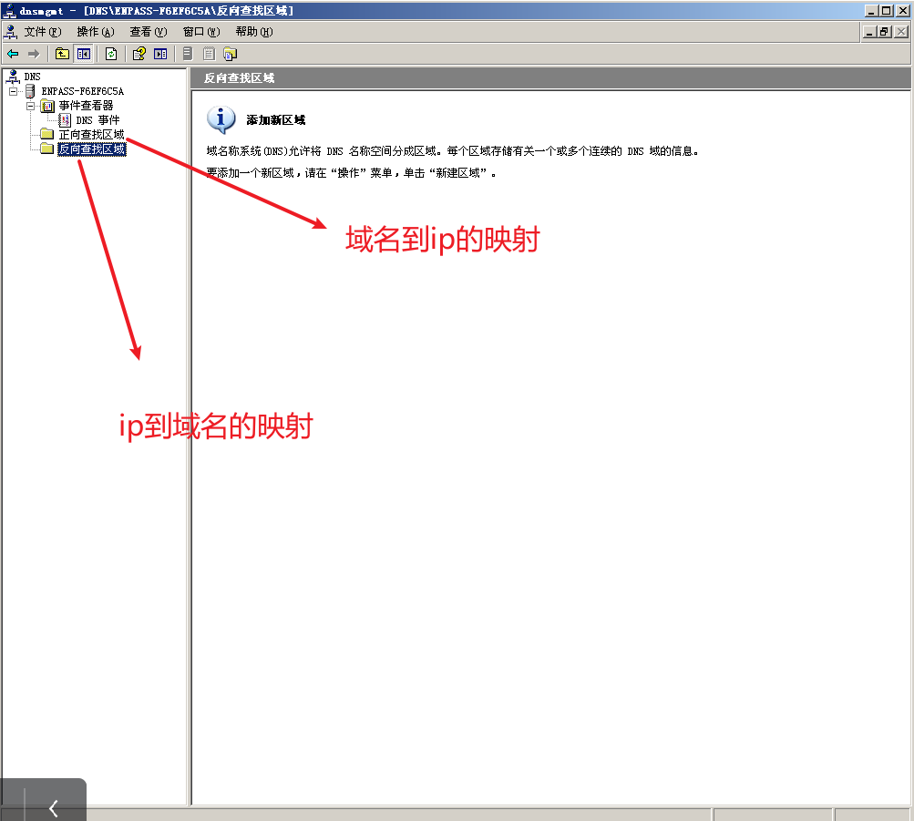
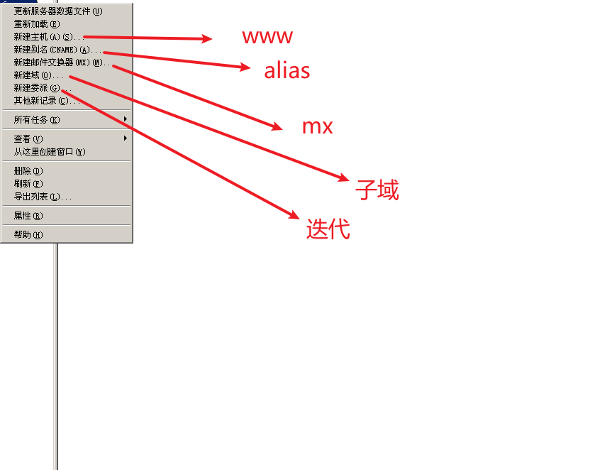
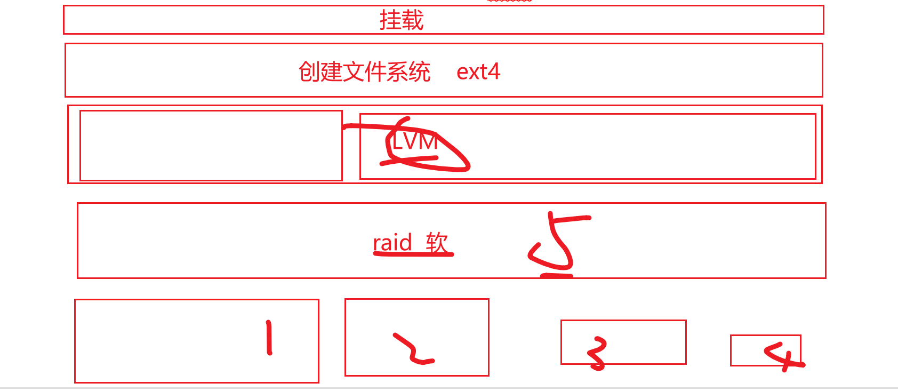
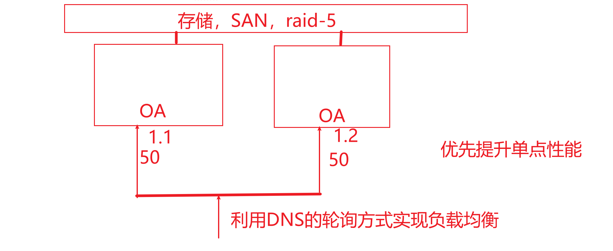

# 王占峰

## 计科：项目管理

# 1	摸底测试

不做任何考核依据，   1小时 ，    只做    1-5，11-15，21-25..............


# 2	项目

为了得到某种  产品  、 服务、 成果 而付出的  临时的  一次性努力。

## 项目特点

临时性：有开始时间，有结束时间， 项目追求结束

独特性：其他项目的资料可以借鉴，而不能直接复用。

渐进明细性：随着项目的推进逐步细化过程


## 项目管理

项目管理综合利用   技能、管理技巧、行业标准、人际关系   实现项目目标

通用的过程：Plan      Do        Check Action

### 人力资源的管理

P：制定人力资源管理规划：定宗旨 ，选标准 ，如何实现标准。确定角色和职责

D：组建团队：   事先分派，谈判，招募，虚拟团队。  从0到1的过程

CA：建设团队：从有到优过程，提高团队绩效，提高个人能力

CA：管理团队：管理冲突


优秀团队的标准：

共同目标

明确自己对目标的贡献

明确的责任划分 RACI 原则

有行之有效的工作流程以及互相学习的环境【结对】

有冲突解决方法


熟悉不同的组织结构对项目的影响：

项目型结构和职能组织型结构：


分组实现任务，每8人一组，每组一名leader

推举一名leader，作为直接**管理**者身份参与

作为一名leader整个项目团队的负责人，考核加权值较高

应该拥有哪些能力：

​	通用的管理技能【KPI】

​	应用领域的知识标准和规定

​	项目管理的技能知识【成本、进度、质量、风险】

​	良好的沟通和协调能力


构建一个顺畅的沟通渠道。简单的沟通【微信群】，复杂的文档【Git】。

课堂实践：   30分钟， 成果物   提交   推选leader的过程【理由】以及决议，截止14：25


# 沟通的认知

沟通的目的  共享信息

沟通存在障碍的： 

​	认知障碍：同源信息的不同理解，无歧义的描述

​	语义障碍：不同干系人经历以及环境

如何做好沟通：

​	主动沟通

​	了解对方的沟通风格和沟通方式

​	采用对方能够接受的共同手段【头脑风暴，纵向，横向思维法】


文档为何需要沟通，组内共享编辑，组外发布。


# 配置管理

事物的属性的描述

通常  ， 硬件， 软件，数据    都会有属性

配置项的集合描述称为   配置库  ，便于理解和统一控制   ， 计算机行业中 配置库通常  有    开发库、主库、产品库  。

结合配置管理工具实现：通常采用  SVN     或者    Git    

主要目标：    记录所有文件的状态，  团队内共享编辑

采用版本号方式便于成员识别：推荐标准      X.Y.Z

X	主版本		架构

Y	次版本		功能

Z	修改状态	有Z代表不稳定  

第一个正式版本：  1.0    ，     0.x   代表草稿


# git基本使用

分布式 多人  共享   库   ， linux   开发者编写的

需要客户端工具平台：    git   

借助于类linux命令实现管理


git add *   将所有文件添加到暂存区

git  commit   -m  “提交日志”    *

git push


# 8021回顾

知识体系：硬件、网络、软件、项目

项目管理：项目、项目管理PDCA、人力资源、沟通、配置【git】


# 网络安全基础

## 1	体系结构概览


## 2	主机接口层

802.3	以太网的工作方式

采用争用介质：  先听后发，边听边发，冲突停止，随机延迟后重发      【解决了使用信道的问题】


发送和接收的问题：【物理地址】

通常称之为MAC地址，出厂自带全球唯一   48位地址，    使用16进制表示

常见的MAC地址： 取值范围  0-F   ，  全1的地址为广播地址   FF-FF-FF-FF-FF-FF  ,  全0地址 包装  源地址  ，

第8位地址为1，代表组播地址，   0 代表单播地址   

通过    ipconfig   /all    或者   ifconfig   

数据的识别问题：  包的格式  


结合   arp工具   ，  操作   mac地址已经绑定关系


### 任务1：阐述海明码的工作机制以及C++实现。

### 任务2：阐述arp协议以及arp命令工作机制及安全防范措施。


## 网络层

选路【路径选择】，识别，隔离

识别的问题：    协议封装格式   IP协议包


IP协议的特点：无连接，不可靠， 尽最大努力服务（TTL --- 解决环路问题）

TTL的协商是由双端通信方确定的，

### 课堂练习：利用ping  草拟出   到达  202.118.66.66  的网络路径， 探测路径的MTU


逻辑层， 利用ip地址进行身份识别 ， 利用ip进行隔离

## IP4地址

32位的逻辑地址，   采用   点分十进制表示   ，    分为   4个字节用点分隔，    1.2.3.255  ，每字节   0-255

IP地址 =  网络号   +   主机号   ，    默认情况下不同网络号的主机不能直接通信，   借助于路由器进行通信

通常   会将  IP分为    多种类别


例如：   

1.2.3.4	和	133.2.3.4   是不是逻辑上的一个网段：false

1.2.3.4   和   1.6.7.8    是不是逻辑上的一个网段 ： True

1.2.3.4   和   2.6.7.8    是不是逻辑上的一个网段 ： false

192.168.2.6   请问网络号    192.168.2        主机号    6

通过  子网掩码  标识  网络号部分（用1标识）和主机号部分（用0 表示）

1.2.3.4   子网掩码   255.0.0.0【默认】

出于VLSM或CIDR的需求。需要人为改动子网掩码进行网络的切分【延长VLSM】和汇聚【缩短CIDR】

例如：  单位申请了一个IP段   199.9.9.0 /24  / 255.255.255.0     ， 需要分为4个逻辑网段。

需要借用几位主机号用以分隔：  2位

每网段IP范围：   

​	199.9.9.0  -  199.9.9.63	             		  /26    /  255.255.255.192

​	199.9.9.64  -  199.9.9.127            		   /26    /  255.255.255.192

​	199.9.9.128  -  199.9.9.191            		/26    /  255.255.255.192

​	199.9.9.192  -  199.9.9.255            		/26    /  255.255.255.192

判断是否能够直接通信的依据是：  IP二进制位与子网掩码 ，结果是网络号，相同则可以直接通信

199.9.9.0  和   199.9.9.64   不一样，必须通过路由器通信


课堂演练： 本单位申请了一个   166.6.0.0/16网段， 全国有3个办事处和一个总部，  规模分别是   北京32000个， 上海   16000个，  重庆8000个，大连总部8000个。

规划各个区域的ip地址范围，包括   网络地址和实际可用地址


特殊的IP地址：

0.0.0.0	表示任意网段，作为目的地址表示任意一个ip

255.255.255.255	表示有限广播地址，等同于  FF-FF-FF-FF-FF-FF

合法网络号 + 全0主机号    表示的是网段的地址        192.168.3.0/24

合法网络号 + 全1主机号	表示的是网段的直接广播地址		192.168.3.255

回环地址：  127.x.x.x   本地回环测试，不通过物理接口直走协议缓冲区

私有IP，  只能在局域网通信   （10.x.x.x/8     ,  172.16.x.x/16 - 172.31.x.x /16    ,   192.168.x.x/24   ,  169.254.x.x  / 16 ）


课堂演练： 本单位申请了一个   166.6.0.0/16网段， 全国有3个办事处和一个总部，  规模分别是   北京32000个， 上海   16000个，  重庆8000个，大连总部8000个。

规划各个区域的ip地址范围，包括   网络地址和实际可用地址


网络号16位 + 主机号16位，  可用的IP   2^16 - 2 = 65534个   

VLSM  延长子网掩码   切分的过程，借用主机号部分作为子网络号部分

1	2	3	4	5	6	7	8      .    1	2	3	4	5	6	7	8

0	0	0	0

0	1	1	1

1	0	0	0	0

​			1	1	1		

1	1	0	0	0

​				  1	1

1	1	1	0	0

​				  1	1

166.6.0.0【子网段】~166.6.127.255【直接广播】     /   17  /255.255.128.0    容纳   32765-2主机【北京】

166.6.128.0【子网段】~166.6.191.255【直接广播】/   18  /255.255.192.0    容纳   16385-2主机【上海】

166.6.192.0【子网段】~166.6.223.255【直接广播】/   19  /255.255.224.0    容纳   8192-2主机【重庆】  

166.6.224.0【子网段】~166.6.255.255【直接广播】/  19  /255.255.224.0    容纳   8192-2主机【大连】  


网络层的路由，根据IP包头的目的地址进行选路 ，  选路的依据是路由表， 路由表一般分为静态（手工维护）和动态（路由器自动学习），路由表的组成（路由类型，路由成本，下一跳）


如何维护路由表：

windows和linux 本身带有软路由。如何获取以及修改

windows：  router   print

linux：  route


路由的类型：

​	直连路由C，  只要网络接口配置IP并且接口是激活状态，形成直连路由，成本为0  

​	静态路由S，   关注  目标网段、目标网段的子网掩码，下一跳

​	默认路由S*，最后一条匹配的路由选项【优先级最低】， 俗称 默认网关【0.0.0.0】

​	

路由匹配过程中， 遵循   掩码长度原则，  掩码越长优先级越高

277-711-380

### 课堂项目：小组为单位实现，通过虚拟机或者wsl方式实现通过手工添加路由进行windows和linux之间的通信【虚拟机平台的构建，路由操作，文档记录】，成果物   路由基础.md   发送到小组群即可


## 模拟实现企业网络环境，借助于模拟器可以模拟  交换机、路由器等

只能使用   192.168.1.0/24网段


# 上周回顾

1	网络体系结构

2	数据链路层【8022.3 】arp 

3	网络层【ip】路由表，静态路由

4	项目管理【项目，资源，沟通】


# IOS的使用

网络设备运行的操作系统， 提供   CLI 【命令行】  功能   ，   管理设备

管理设备都有什么方式？  web管理端，命令行，console连接【初始化】


ios   其实是unix的变体

1	tab补齐  ，补齐命令和  参数   ,  能补齐代表可以缩写

2	上下方向键 ，翻阅历史记录

3	history调取所有历史记录

4	？  查阅帮助


通过命令字实现基本操作

课堂演练：实现网络基本布局图【配置使用CLI完成】


网络设备：

集线器：  HUB   ，  物理层连接设备 ，    共享带宽，一个冲突域


交换机【二层】，Switch     ，  数据链路层  连接设备，    共享带宽，虚拟通道， 切割冲突域


路由器【三层】， router，   网络层连接设备  ，    切割广播域


全局模式对设备生效的（conf   t）， 接口模式(int 接口名)只对当前接口生效


# 交换机的工作方式

根据  端口和MAC地址映射表（自动数据帧源地址学习--动态（300S））进行转发操作 ，如果不存在条目，则广播（除了输入口之外的所有口）【arp广播——源地址发送者地址，目的地址FF-FF-FF-FF-FF-FF】，实际接收者回应   单播   信息。


# 局域网网络安全

1	使用虚拟局域网     VLAN

2	VLAN用以切割广播域

3	在数据帧添加头部信息用以识别， 通常是在交换机上执行 添加/拆除操作  。

4	VLAN的形式：  802.1Q 标准  ，   ISL标准


5	VLAN注意：   VLAN1是默认的不可删除的默认所有端口都在VLAN1的  ， VLAN根据id不同进行匹配 ，VLANid  从   1 -4096  ，建议规划方式      100，200，300

6	vlan有两种模式：  接入模式access（只能访问1个vlan信息）  ，  干道模式trunk（利用一条线路传输多个VLAN数据）

```shell
SW>enable	#进入特权模式
sw#show vlan	#查看vlan配置信息
sw#configure terminal	#进入全局配置模式
sw(conf)#vlan  100		#添加id为100 名称为  vlan0100的vlan
sw(conf-vlan)#vlan  200		#添加id为200 名称为  vlan0200的vlan
sw(conf)#interface fa0/1	#进入端口配置模式
sw(conf-if)#switchport mode access	#设置当前端口为access接入模式
sw(conf-if)#switchport access vlan 100	#当前端口可以访问vlan 100
sw(conf-if)#exit
sw(conf)#interface range fa0/2-9	#同时进入多个接口配置
sw(conf-if)#switchport mode access	#设置当前端口为access接入模式
sw(conf-if)#switchport access vlan 200	#当前端口可以访问vlan 200
sw#show vlan


```


# Vlan trunk

需要公共通道传递多个vlan的数据，一条线路承载多个vlan的通信，  解决access占用过多线路

Trunk通信时类似于包转发方式，   干道上的所有帧都带有vlan标记


 单臂路由，实现不同vlan之间的通信，路由器的物理接口可以绑定多个逻辑子接口

路由和交换基础实验

提交： markdown文档， 打包提交至  微信群

文档内容：概念，使用场景，实现步骤（配置命令+截图）

先决条件：申请到了199.9.9.0/24网段


# 动态路由

如果接口配置了ip并且激活状态， 则存在   C  的 直连路由， 直接到达目的地，成本为 0

非直连网络需要    手工添加    静态路由      S     ，    成本   为   1，

默认路由     是   特殊的静态路由      S*      ，   最后匹配， 优先级最低   ，  一般存在于末梢网络

通过路由汇总可以解决路由条目过多。


动态路由的工作原理：

路由器之间相互学习，发送路由通告，通常有两种方式【组播，广播】，  通常是告知相邻路由器

两种方式：

1	距离矢量类DV


128路由器串联，每次路由宣告间隔30s，为了避免路由表统一时长过长【路由收敛】，  通常动态路由协议  最多16个路由【450秒】，   如果路由器接口断线， 则会将跳数更新为  16跳【不可达】，通常可以通过  水平翻转【防止环路发生】，   使用保活计时器防止路由出现抖动。


课堂练习：    构建一个串联的 4路由网络，配置基本IP

RIPV1   采用广播方式宣告路由

RIPV2	采用组播地址    224.0.0.9宣告【推荐】


距离矢量路由协议缺陷， 路由收敛速度慢 ，衡量标准只根据跳数


2	链路状态类LS

区域指定一个  主路由收集区域内路由信息，   由主路由向外宣告自己的网络拓扑，  接收其他网络拓扑，  自行计算路由【收敛速度快，成本高】


路由器的id通常是回环地址，  回环地址通常用作远程管理路由器

二层交换机可以配置ip，配置给vlan，只能用作管理地址


网络层主要协议：


ping     测试网络双向联通性的，发送ICMP包，通常有2个类型（0，8）

-l		65500   指定发送的包大小

-t		持续


# 传输层

负责端对端业务，只需要关心发送和接收两端，中间过程不考虑。

主要实现协议有     TCP，UDP

TCP：传输控制协议，可靠的，面向连接的，数据流，全双工   ，稳定的服务器需要TCP

UDP：User  Datagram    protocol用户数据报协议，     不可靠，非面向连接，数据报   ，实时通信用UDP   ，如果下层不能确保可靠性，则可靠性由上层负责

TCP协议


TCP工作流程


课堂实践： 使用网络抓包工具  tcpdump,iris,fiddler, wireshark     浏览器地址栏输入     http://search.dangdang.com/?key=tcp+ip&category_path=01.49.00.00.00.00      描述按下回车后工作过程，通过包分析  联通过程以及  携带的关键字   ：通过MD格式按组提交


# 通过TCP实现通信

参考思路：   一切皆文件


如何实现：C或C++【建议】


# 应用层服务

通用终端，HTTP，DNS，邮件 ，  ...................................


实现HTTP+DNS服务，   都是基于    C/S   结构的， 

基础平台：   虚拟机 + 虚拟系统（windows2003 server）  


通用的服务，使用开源的已成型。

操作系统： 负责   会话层，表示层，应用层  ， 以windows2003为例

实现HTTP服务器：

1	HTTP，超文本传输协议，明文传输，典型的C/S结构模型，C使用了通用的客户端{浏览器}，被称为B/S结构，HTTP包头含有

1.1	方法，   GET，POST，OPTIONS，DELETE，PUT   代表一种操作，   语义化编程

1.2	状态码【通用】，2xx  成功   ，  3xx路由，4xx资源错误，5xx服务器程序错误

1.3	结合MIME（多用途的internet邮件扩展————扩展名）处理文件

1.4	无状态协议


2	HTTP服务器的实现

选择   ：     IIS，      Apache    ，   Tomcat    ，   Ngnix      ，     IIS是windows服务器系统自带功能， 通过添加删除windows组件    ，  安装   IIS   （Internet   Information  Service）


3	web站点有3种形式【一个服务器运行多个web】

3.1	不同ip地址

3.2	同IP不同端口

3.3	同ip同端口不同主机头


课堂实现：   通过同ip同端口不同主机头实现，在客户端   访问    www.a.com    www.b.com     ，   通过修改客户端   hosts   文件实现静态的域名和Ip的映射关系


虚拟机克隆实现多个windows系统后，  需要更改计算机名称，必要时需要更改   SID


所有的访问者都得修改hosts文件   ，  应该通过DNS取代

# DNS

Domain  name   server  域名字服务，负责   域名和IP的相互映射

DNS采用   分层   分布式   数据库方式


DNS的解析过程


## 实现DNS服务器

1	安装




2	配置

主要区域：负责区域数据的编辑【增，删，改】，

辅助区域：主要区域的备份，可以和主要区域负载均衡，

主要区域到辅助区域的同步称为  区域复制   ，  使用TCP的53端口

DNS的默认请求使用  UDP   53 端口 

DNS域名的构成：    点分逆序，256字符，64分层 




开启客户端进行测试

1	配置本地DNS


## DNS客户端测试工具

ping   ：   ping   www.baidu.com

nslookup :        

1	直接方式


2	交互方式


# 大作业


# 如何确保服务器安全

网络安全使用防火墙

数据的安全【加密，权限，备份，存储】

## 权限管理

权限管理基于  sid（windows的安全id）  或   id（类unix系统）

1	课堂实验：    创建一个普通用户【隐藏用户】   ，使其拥有超级管理员权限  。让一个普通用户拥有root的权限。

1.1	通过   net命令可以执行  网络操作

1.2	windows中 ，$结尾代表   隐藏    ，    例如   C$   默认的隐藏共享， 建议关闭  

1.3	windows中，  用户信息储存在   c:\windows\system32\config\sam   文件中，   注册表中    HKEY_LOCAL_MACHINE\SAM\SAM   中


为了便于权限分配，   通过组给用户集体授权，    组的权力会被组内用户继承。    

复合授权过程：  用户可以属于多个组， 用户的权限是多组权限的复合，权限有冲突，拒绝最大。


linux授权机制：   

用户管理【userXXX】，组管理[groupXXX]，  文件所属管理【chown，chgrp】，权限管理【chmod   ， augo用户助记符，+-=  赋权操作，  rwx权限助记符 ，   可以使用   8进制处理   】


小组作业：  

公司  com   ，拥有  两个部门   sales和market   ，  其中user1，user2属于sales组，  user3，user4属于market组，    所有用户可以完全控制自己的目录，只读访问部门公共的目录   ，   管理员  admin  维护部门公共目录   。


实现逻辑：  windows截图体现   ，  linux 通过shell脚本体现   


用户是使用资源的主体，采用授权原则【DAC自主访问控制，MAC基于标记的强制访问控制，RBAC基于角色的授权-不能再授权】，   控制对资源的访问

用户名称仅用于人类识别， 鉴权识别   sid   ，    id   ，   伪造超级用户身份

文件权限的分配：  确保支持权限系统【NTFS ，  EXT】，权限由两个部分构成【本地文件权限--NTFS，EXT+共享权限CIFS，SMB】，权限可以被继承，权限有冲突，拒绝最大


创建新文件的权限默认由   umask  设置  


# 存储

硬盘【机械，固态】

固态：电子存储模式，快，读写次数受限

机械：适合长期存储， 价格低，高转速磁盘提供性能


机械硬盘的存储机制


查看文件详情信息， 可以使用   stat命令

截止：   10：00

可以使用    软链接和硬链接进行文件管理

软链接和原始文件是两个文件，通过引用关系关联，inode编号不同，原始文件不存在软链接失效，软链接可以跨磁盘存在   ，   ln   -s   创建软链接

硬链接是通过不同位置或者不同名称访问同一文件的方式，  一个文件记录了多个文件名， links 为 1的时候再删除则从磁盘清除文件， 添加硬链接links+1，删除则-1   ， 不能跨磁盘   


.	当前目录                   ..     父目录


## 磁盘管理

如果单个磁盘不能满足业务需求， 可以使用磁盘阵列组合方式实现用户需求【RAID--廉价磁盘冗余阵列】

磁盘阵列和系统连接的方式：【DAS--直连式存储   ，   NAS-网络存储（接入标准TCP/IP网络）， SAN存储区域网络】


windows下   基本磁盘只能实现：分区管理【主分区<=4+扩展分区<=1  =最多 4个  】

主分区存储操作系统的引导记录，   扩展分区不能直接存储数据，需要划分为逻辑驱动器存储

如果需要实现raid模式，必须是动态磁盘。

raid的常见模式：

业务需求：   存储 蓝光光盘大小   48G  xxx.iso    

raid-0【降级版】   模式，   跨区卷模式 ，   合理组合多个磁盘的空闲空间为一个大型空间，  多个磁盘空间可以不同，线性存储模式，可靠性低。可用空间=贡献空间*1

业务需求：   要求快速   读取写入  数据【无盘站服务器】  

raid-0模式，     带区卷模式，多个磁盘共享相同大小空间，分布式存储，平均划分存储，读写速度最快 ，   可靠性低  ，可用空间=贡献空间*1


业务需求：  确保数据可靠，不应出现单点故障

raid-1模式，     镜像卷模式，   两块磁盘共享相同大小空间， 同时写入，可以分布读出，   写入速度和单磁盘相同，读出速度可能优于单磁盘。可靠性提升 ，可用空间=贡献空间*0.5


raid-3或raid-5：  多磁盘贡献同等大小空间， 利用率   可用空间   =   贡献空间*(N-1)/N,    可靠（不能同时损坏2块）


关于可靠性的计算：

MTBF =   平均无故障时间/（平均无故障时间+平均故障修复时间）


磁盘划分空间之后，   需要格式化

格式化：创建文件系统FS  ，   文件存取访问的方式叫做文件系统。   

分区，卷     其实是空间称谓，     需要通过     挂载点【c:\  盘符   ，       /root   ,  还可以使用 文件夹作为挂载点】  访问空间


研读    linux    LVM   实现动态磁盘管理   ，使用磁盘配额限制用户的可使用空间和inode数量

提交md格式文档：    linux下实现LVM+raid+磁盘配额.md      附带    组内评分.txt(每人贡献5分)       


存储，磁盘管理，DAS

分区，卷（raid-0  1    5）【特点，可靠性，利用率】，LVM+raid




通过对存储设备进行管理：   

1	raid	：  实现空间组合利用，可靠性提高

2	LVM   ：   实现空间的弹性分配

3	FS	  ：   实现权限分配

4	mount   ：   访问点

解决了部分硬件故障引发的数据安全问题，能否解决人为损坏数据？ 


# 备份策略

正常数据存储一个副本类消息， 以备损坏后恢复

tarball   结合    zip工具  

备份类型：

1	完整备份：所有数据拷贝一个镜像内容，修改存档标记【备份标记】，消耗空间最大，恢复时间长，所有备份的基础。【可以采用的方案windows提供的backup工具(文件)，备份引导记录（磁道，MBR）使用 ghost  ，  使用   linux下的  dd  ， linux下备份工具  tar（文件） 】

2	副本备份：完整备份， 不操作存档标记【备份标记】

3	差异备份：备份和上次完整备份之间差异的部分，不修改备份标记，恢复时使用  完整备份  +   最后一次差异备份。

4	增量备份：备份和上一次增量或者完整之间变动的部分，修改备份标记，恢复时使用完整+所有增量【linux下tar 的   -g  选项实现增量】


linux的命令：

[root@localhost ~]#   命令字              选项             参数

root	代表当前用户，   如果需要切换身份 ，    使用   su    switch user， 临时切换身份执行命令    sudo   

localhost   代表当前主机名称

~	代表当前所在目录，  可以通过   pwd   获取，     ~   代表用户宿主目录

命令字和选项以及参数之间用    空格   分隔

选项有两种：      -  短选项，  多个短选项可以压缩   -l   -i   -a      压缩为     -lia

​							 --长选项，   完整单词，不可拆分

ls   -R  -lia   --deeps  /

man   关键字     获取帮助信息


linux如何实现  ：    

登录时备份：~/.profile

开机时备份：/etc/rc.local

周期性备份：cron   实现   


课堂演练：     windows下实现  每10分钟进行完整备份， 每2分钟进行 增量备份，注意观察   备份标记，   模拟破坏数据然后恢复

下午演练：     linux下实现


应用层服务层面实现：HTTP，FTP，DNS，



数据管理：授权，raid，lvm卷弹性，备份

根据业务需求选择    数据管理方案。   网站  


存储安全更多的是在内部应用中体现

内网服务主要的服务对象是局域网用户，通常  DHCP   ，轻量级目录访问服务OLDP【windows 的  AD--域管理，linux下   NIS   】

windows采用网络管理形式

1	工作组模式   ：   workgroup   ，  管理方式是平等的， 非强制制约的，DAC原则 ，扁平式结构

2	域        模式   ：   domain    ，        管理方式是集中的，强制制约       ，MAC原则，金字塔结构


设计：

客户端需要由ip，服务器应该具备分配IP地址的能力，安装DHCP服务， 备份策略（完整+增量）

域管理需要DNS支持，服务器应该安装DNS。备份策略（完整+增量）

用户数据存放在raid5空间， 备份策略自选


DHCP工作机制


1	设置服务器为静态ip

2	安装dhcp服务


安装DC


将客户机加入到域

因为 虚拟机都是  克隆的， 所以   SID 相同，   重新封装获得新的SID


放置在  raid5  磁盘中

配置用户信息， 实现用户配置迁移

共享文件方式，实现用户   网络驱动器访问共享文件【权限】


所有文件有备份


提交方式：     域管理综合实验(组内评分).zip


